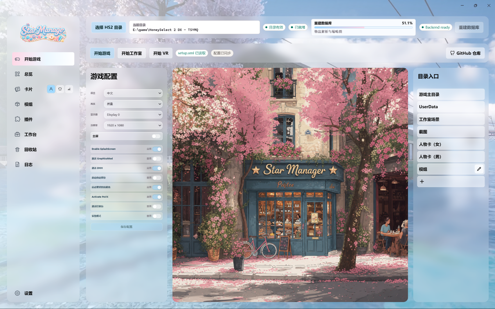
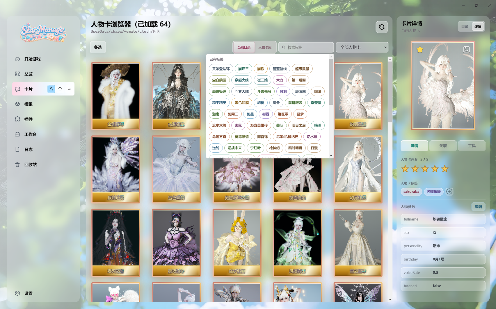

# Star_Manager 概览
这是一个开源的vibecodeing项目，旨在帮助hs2游戏玩家更快的融入AI

不管你是新手小白还是老东西，希望这个项目能帮到你们

那么这个项目能做什么：帮你管理mod、解决疑难杂症、自定义属于自己独一无二的游戏管理器、修复损坏（破解加密）mod、帮你写插件、在你的不断提问中变得更加聪明。。。

如何开始？

  打开你的agent，然后将下面这段话粘贴到对话栏里
  
  “https://github.com/lunaburg/Star_Manager.git  帮我拉取这个github项目并在本地运行，帮我补全运行该项目所需的全部依赖”
  
  因为我使用的是codex+gpt luna，不保证其它情况下的可靠运行

  郑重声明：本项目不得以任何形式收费，包括赞助

