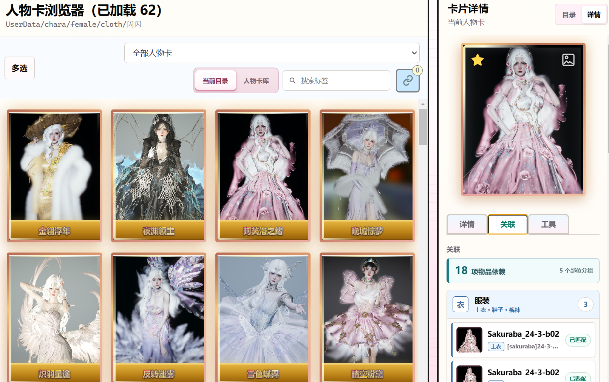

# 角色卡库布局

## 目标

角色卡库用于浏览所选 HS2 游戏目录中的 AIS 人物卡、服装卡和 Studio 场景卡。该模块在导航中显示为“卡片管理”，侧栏的三个 SVG 类型按钮可互斥切换人物卡、服装卡和场景卡子界面。人物卡、服装卡和场景卡均已接入独立浏览与缩略图接口；服装卡保留完整解析详情，场景卡提供文件详情、场景级依赖解析和目录定位。文档内仍以“角色卡库”描述人物卡业务边界。

## 卡片预览图统一加载规则（长期规则）

人物卡、服装卡以及后续新增的卡片类型，所有列表预览图必须统一采用服装卡浏览器已验证的加载逻辑：

- 列表接口只返回轻量卡片信息和稳定的预览 URL，不为显示缩略图执行完整卡片解析。
- 预览图统一复用后端标准化 `card_previews` 缓存，并以源文件路径、大小、`mtime_ns` 和目标尺寸作为缓存签名；不得在前端直接读取或重复解码原始卡片 PNG。
- 列表网格统一使用 `LazyThumbnail` 的 `IntersectionObserver`，只请求视口附近图片；首屏附近可以设置有限数量的高优先级图片，不能取消整体懒加载。
- 卡片数量可能超过一个视口时，必须使用虚拟网格，只创建视口前后少量行的 DOM；分页数据也不得无限制地同步渲染为完整卡片树。
- 点击卡片后才加载完整详情、依赖和关联信息。详情预览可以按需加载可见 PNG，但仍应优先使用标准化预览缓存；只有明确需要原图时才请求 `original=1`。
- 新增卡片类型或新的卡片列表入口时，必须复用上述缓存、懒加载和虚拟渲染边界，并在本文件和缓存登记中同步记录例外情况。

该规则只约束预览图和列表展示链路，不改变卡片详情的完整解析、依赖匹配、原始文件写回或删除恢复行为。

### 人物卡浏览器统一预览加载记录（2026-09-13）

- 背景：人物卡列表此前虽然使用了 `LazyThumbnail`，但仍通过普通 `v-for` 一次性创建当前筛选结果的全部卡片 DOM，卡片数量较多时会增加首屏布局和滚动开销。
- 方案：新增 `VirtualCharacterCardGrid`，按照服装卡和物品浏览器的虚拟网格逻辑，只渲染视口前后少量行；首屏附近有限数量的预览图优先加载，其余继续通过 `LazyThumbnail` 的 `IntersectionObserver` 请求。保留收藏主题、标签悬浮、缺失依赖徽章、批量选择和键盘点击行为。
- 验证：`npm run build` 通过；人物卡详情、批量操作、筛选结果和标准化 `card_previews` 缓存边界不变。
- 适用边界：该调整只改变人物卡列表的 DOM 和预览请求时机；单卡详情仍在用户选择卡片后按需读取完整信息，原始封面仍不在列表阶段加载。

### 人物与服装卡浏览器刷新按钮共用透明玻璃样式记录（2026-09-13）

- 背景：人物卡浏览器标题栏右侧的刷新按钮已经使用透明玻璃样式，但服装卡刷新按钮仍使用深色粗边框和实色背景，两个卡片浏览器的同类控件不一致。
- 根因：服装卡按钮只使用通用 `.module-icon-button`；人物卡的玻璃样式原先被 `.character-layout` 作用域限制，无法直接复用。
- 解决方案：抽出 `.card-browser-refresh-button` 作为人物卡与服装卡标题栏刷新按钮的共享样式，使用共享玻璃变量、半透明表面、10px 背景模糊、细白边和轻微内沿高光；悬停、聚焦和禁用旋转状态保持原有交互语义。
- 验证结果：通过 `npm run build` 与 `git diff --check` 验证；刷新调用、按钮尺寸、禁用条件和加载旋转动画保持不变。
- 适用边界：仅影响人物卡和服装卡浏览器标题栏右侧刷新按钮，不改变场景卡刷新按钮、人物卡工具栏控件或其他页面的图标按钮。

### 卡片浏览器名称铭牌统一玻璃化记录（2026-09-13）

- 背景：人物卡、服装卡和场景卡列表底部的名称铭牌使用不同程度的粉色、橙色或收藏主题实色背景，与参考界面的浅色透明玻璃层不一致。
- 方案：三类卡片共用的 `.card-caption` 改为冷白半透明背景、10px 背景模糊、细白上下边缘和轻微内沿高光；收藏卡保留原有字体、边框、流光和收藏识别效果，但名称铭牌背景统一为同一套白色玻璃表面。
- 验证：运行前端生产构建和 `git diff --check`；名称溢出滚动、缺失依赖徽标、选中态以及人物/服装/场景卡的列表交互保持不变。
- 适用边界：仅调整三类卡片浏览器列表中的名称铭牌视觉，不改变卡片图片、详情预览、文件数据或收藏设置。

### 收藏卡名称铭牌回退记录（2026-09-13）

- 背景：统一玻璃化后，收藏卡名称铭牌也继承了白色透明模糊背景，与收藏卡参考样式不一致。
- 方案：收藏卡列表名称铭牌覆盖为不透明暖色渐变、暖色边缘和深暖色文字；普通人物卡、服装卡和场景卡仍使用白色透明玻璃铭牌。收藏卡的暖橙边框扫光与详情星标保持不变。
- 验证：前端生产构建和 `git diff --check` 通过；名称溢出滚动、收藏状态写回和详情操作保持不变。
- 适用边界：仅改变收藏卡名称铭牌的背景与文字对比，不改变普通卡铭牌、收藏数据或卡片图片。

## 卡片类型子界面

卡片管理侧栏包含三个互斥的类型按钮：

三个类型按钮使用单色图标：人物卡、服装卡和场景卡均使用资源目录中的 SVG；按钮采用 7px 圆角和 3px 间距，激活态使用浅蓝色描边与背景强调。

- **人物卡**：显示本页现有的人物卡浏览器、目录树、详情和批量操作。
- **服装卡**：切换到服装卡独立浏览工作区，资源根目录显示为 `UserData/coordinate`。
- **场景卡**：切换到场景卡独立浏览工作区，资源根目录显示为 `UserData/studio/scene`；列表按目录分页加载 PNG 场景卡，预览比例为 `320:180`，点击后可查看文件详情、场景级依赖和打开所在目录。

激活类型由单一的前端 `cardBrowserMode` 状态维护，因此任意时刻只有一个按钮处于激活状态。服装卡使用独立的目录扫描、增量索引和只读详情链路，不复用人物卡 SQLite 索引；场景卡使用 `UserData/studio/scene` 的独立目录扫描链路，不复用人物卡和服装卡索引。

### 人物卡与服装卡类型图标替换记录（2026-09-13）

- 背景：卡片管理侧栏中的人物卡、服装卡按钮仍使用旧的内联线框图标，与参考界面和用户提供的图标视觉不一致。
- 方案：将用户提供的 `人物.svg` 与 `服装.svg` 纳入 `apps/src/assets/`，通过 Vue 资源导入替换前两个卡片类型按钮；场景卡图标保持现有内联实现。
- 验证：前端生产构建通过后，确认两个资源均被 Vite 正确解析，按钮的标签、激活态和切换事件保持不变。
- 适用边界：仅影响卡片管理侧栏的人物卡和服装卡图标，不改变卡片类型切换逻辑、场景卡图标或卡片浏览业务。

### 场景卡图标去除外框记录（2026-09-13）

- 背景：场景卡类型图标包含与参考界面不一致的外层相框边界。
- 方案：接入用户提供的 `svg.svg`，移除其代表外框的路径，仅保留圆点和山景图形；场景卡按钮自身的交互边界保持不变。
- 验证：前端生产构建通过，场景卡按钮的标签、激活态和切换事件保持不变。
- 适用边界：仅影响场景卡图标的图形内容，不改变按钮容器、卡片类型切换逻辑或场景卡工作区。

### 场景卡占位内容移除记录（2026-09-13）

- 背景：场景卡占位页中的英文眉题、辅助说明、装饰图标、空状态文案和切换提示与当前界面要求不一致。
- 方案：仅在场景卡模式隐藏上述红框标注内容，保留“场景卡浏览器”、资源根目录、浏览器状态和卡片类型按钮；服装卡继续显示原有占位页内容。
- 验证：前端生产构建通过，场景卡与服装卡仍可通过同一组类型按钮切换。
- 适用边界：仅调整场景卡占位页的可见内容，不改变卡片类型切换、目录状态或后续场景卡接入边界。

### 场景卡浏览器接入记录（2026-09-13）

- 背景：场景卡页面原先只有 `UserData/studio/scene` 的静态占位工作区，无法浏览实际场景文件。
- 方案：复用服装卡的目录树、分页列表、虚拟网格、懒加载缩略图、详情侧栏和打开目录交互；后端新增场景卡目录、列表、详情和图片接口。场景卡不执行 `AIS_Clothes` 解析和服装卡 SQLite 索引，仅在场景根目录内枚举 PNG 文件。
- 比例适配：场景卡虚拟网格复用 `VirtualClothesCardGrid`，通过参数使用 `320:180` 横向预览比例；详情预览和标准化缓存同样使用 `320 x 180`，图片采用等比显示。
- 验证：场景卡与服装卡专项测试共 7 项通过，Python 编译检查和 `npm run build` 通过。
- 适用边界：当前场景卡浏览以 PNG 文件为资源单位，名称使用文件名；不解析或修改 Studio 场景内部数据，不提供删除、移动或写回操作。

### 场景卡依赖解析与关联页签记录（2026-09-13）

- 背景：场景卡浏览器此前只枚举 PNG 和显示文件信息，无法识别 Studio 场景保存的地图模组依赖。
- 根因：Studio 场景的 `KKEx` 结构不同于人物卡/服装卡；除旧格式的 `mapInfoGUID` 外，部分场景卡使用嵌套 MessagePack bytes 保存 `itemInfo` 和 `patternInfo`。
- 方案：新增场景卡解析器，在单卡详情请求中读取 `【StudioNEOV2】` 场景数据、场景级 KKEx 插件和三类 UAR 记录；地图按 GUID 匹配 zipmod，场景物品/图案按 GUID + Slot/LocalSlot 匹配本地物品；场景卡详情增加“详情 / 关联”页签，并按“场景地图 / 场景物品 / 场景图案”标识。
- 展示规则：场景物品/图案未匹配本地物品数据库时，关联页按 ModID 合并为“场景模组”条目，并显示该模组下的缺失记录数量；已匹配记录仍按具体物品逐条展示。人物卡和服装卡继续按物品条目展示。
- 验证：场景卡解析专项测试、场景卡详情接口测试和前端生产构建通过；附件格式的 34 条 `itemInfo` 与 2 条 `patternInfo` 去重后解析出 18 条逻辑依赖。
- 适用边界：列表阶段仍只读取轻量文件元数据和预览；不自动把嵌入人物卡或无关场景对象配置转换为依赖，也不修改场景文件。

### 场景卡远端依赖补全记录（2026-09-13）

- 背景：场景卡关联页已经能够识别本地缺失的地图、场景物品和图案，但此前远端索引查询与下载操作只对人物卡开放。
- 方案：新增 `/library/scene/missing-mods`，沿用人物卡的 GUID 分组和远端候选结构；场景卡详情加载后自动查询未匹配 ModID，关联页提供单项安装、全部安装、暂停、继续和取消操作，并复用 `download_card_missing_mods` 的安全下载与单 zipmod 索引流程。
- 刷新规则：下载完成后重新读取当前场景卡详情。地图按 manifest GUID 判断，场景物品/图案继续按 GUID + Slot/LocalSlot 精确匹配；同 GUID 的远端候选不保证包含目标场景物品。
- 验证：远端补全专项测试覆盖场景依赖分组、同模组多条使用记录和本地已有 zipmod 但物品缺失的情况；Python 场景/远端测试、`git diff --check` 与 `npm run build` 通过。
- 适用边界：远端索引只提供有效 manifest 候选，不会修改场景 PNG；远端索引中没有对应 GUID、下载校验失败或安装后缺少具体 Slot/LocalSlot 时，依赖仍显示为缺失。

### 场景卡详情外框比例修复记录（2026-09-13）

- 背景：场景卡详情复用了服装卡详情的预览容器，通用固定高度覆盖了场景卡的 `320:180` 比例，导致横向图片被放进竖向外框并出现上下留白。
- 方案：在通用服装卡详情样式之后追加场景卡专用覆盖规则，设置外框 `aspect-ratio: 320 / 180`、自适应高度和不小于可用宽度的约束；服装卡详情样式保持不变。
- 验证：前端生产构建和 `git diff --check` 通过。
- 适用边界：仅调整场景卡详情预览外框的尺寸比例，不改变场景卡图片接口、图片内容、文件信息或服装卡详情布局。

### 场景卡详情移除黑色边框记录（2026-09-13）

- 背景：场景卡详情预览沿用了服装卡详情的黑色边框，与场景卡横向预览的展示要求不一致。
- 方案：仅在场景卡详情专用样式中将边框设置为 `0`，保留 `320:180` 比例、圆角和图片内容；服装卡详情边框保持不变。
- 验证：前端生产构建和 `git diff --check` 通过。
- 适用边界：仅影响场景卡详情预览外框，不改变图片加载、文件详情或其他卡片类型样式。

### 场景卡详情封面完整显示修复记录（2026-09-13）

- 背景：场景卡详情封面下半部分未完整显示。
- 根因：详情模板优先请求原始 PNG，并将图片同时强制设置为相框的 `100%` 宽高；遇到实际尺寸或比例不一致的场景图时，容易造成可视区域裁切。
- 方案：场景卡详情优先使用后端按 `320 x 180` 标准化、完整保留内容的预览缓存；图片改为 `auto` 尺寸并通过 `max-width` / `max-height` 等比限制在详情相框内。
- 验证：前端生产构建通过；场景卡详情仍保持 `320:180` 相框比例、完整图片显示和文件信息布局。
- 适用边界：仅调整场景卡详情封面的加载和显示方式，不改变场景卡源文件、列表缩略图或服装卡详情样式。

### 场景卡详情预览边缘统一修复记录（2026-09-13）

- 背景：场景卡详情预览顶部出现灰色边缘，底部与图片内容衔接不一致。
- 根因：场景卡复用服装卡详情相框的 `4px` 内边距和灰色背景，图片比例不一致时会露出该背景，形成不对称的边框观感。
- 方案：场景卡专用预览移除内边距和灰色背景，图片占满 `320:180` 预览区域并保持 `contain` 等比显示；比例不一致时仅保留透明留白。
- 验证：前端生产构建通过；场景卡封面完整显示，服装卡详情的内边距和背景保持不变。
- 适用边界：仅调整场景卡详情预览的 CSS 边缘显示，不修改场景卡 PNG、图片接口或文件详情布局。

### 服装卡与场景卡浏览器控件玻璃化记录（2026-09-13）

- 背景：服装卡和场景卡浏览器中仍有刷新按钮、卡片按钮、目录树、详情页签、文件信息、打开目录和依赖操作等实色控件，与人物卡浏览器的透明磨砂背景不连续。
- 方案：复用人物卡浏览器的冷白玻璃控件语言，为服装卡和场景卡建立共享作用域，统一卡片按钮、标题刷新、目录/详情切换、目录树行与展开按钮、详情页签、路径/元数据、预览相框、依赖摘要/分组/条目、匹配状态以及安装、暂停、继续和取消控件的半透明表面、细边界、内沿高光、模糊和 hover/focus 过渡；缺失状态保留半透明红色语义色。
- 验证：通过 `npm run build` 与 `git diff --check`；服装卡/场景卡的目录扫描、卡片选择、详情/关联切换、依赖跳转和远端安装任务逻辑保持不变。
- 适用边界：仅调整服装卡与场景卡浏览器及其详情侧栏的视觉样式，不改变图片、卡片解析、依赖匹配、文件写回或人物卡控件。

### 人物卡浏览器工具栏改为透明玻璃样式记录（2026-09-12）

- 背景：人物卡浏览器顶部筛选工具栏使用实色浅蓝背景，与页面主体的透明磨砂玻璃视觉不一致。
- 根因：通用 `.toolbar` 为工具栏设置了不透明的 `#f8fbff` 背景，覆盖了浏览器面板的玻璃层次。
- 解决方案：仅在人物卡浏览器工具栏范围内改用共享玻璃背景变量，增加 10px 背景模糊、轻微饱和度和顶部内沿高光；保留筛选、搜索和多选控件自身的样式与交互。
- 验证结果：通过 `npm run build` 与 `git diff --check` 验证；工具栏控件布局、标签切换、搜索和人物卡筛选逻辑保持不变。
- 适用边界：仅影响人物卡浏览器顶部工具栏，不改变服装卡、场景卡或其他页面的工具栏背景。

### 人物卡浏览器顶部区域取消独立边界记录（2026-09-12）

- 背景：工具栏玻璃层与下方人物卡区域之间形成独立的带状边界，视觉上与下方背景不连续。
- 根因：工具栏覆盖了单独的玻璃背景、顶部内沿高光和底部边框；人物卡标题栏也保留了通用标题底边。
- 解决方案：仅在人物卡浏览器中移除标题栏和工具栏的底部边框、独立背景、模糊层及内阴影，使两者直接使用浏览器面板的统一背景。
- 验证结果：通过 `npm run build` 与 `git diff --check` 验证；标题、刷新按钮、搜索筛选和卡片区域布局保持不变。
- 适用边界：仅影响人物卡浏览器顶部区域，不改变其他页面或服装卡、场景卡子界面的工具栏样式。

### 人物卡批量工具与筛选控件适配玻璃背景记录（2026-09-12）

- 背景：批量操作按钮、标签范围切换、搜索框和人物卡筛选框仍使用较实的白色、粉色、黄色或红色底色，与统一后的透明工具栏衔接生硬。
- 根因：这些控件沿用通用按钮、输入框和筛选器的实色背景及较强边界，缺少与工具栏背景一致的透叠层次。
- 解决方案：仅在人物卡浏览器工具栏范围内统一使用半透明玻璃底、细边缘和轻微内沿高光；保留移动、标签、删除和提取的语义色，并为悬停、聚焦和范围切换增加平滑过渡。
- 验证结果：通过 `npm run build` 与 `git diff --check` 验证；批量选择、全选、移动、标签、删除、提取、搜索和筛选逻辑保持不变。
- 适用边界：仅影响人物卡浏览器红框工具栏中的控件，不改变卡片内容、详情工具或其他页面的按钮样式。

### 人物卡详情控件适配玻璃背景记录（2026-09-12）

- 背景：卡片详情红框内的页签、评分星级、标签、编辑按钮和人物参数行仍使用偏实体的白色/彩色控件，与右侧导航栏的透明磨砂背景衔接生硬。
- 根因：详情控件沿用通用页签、按钮、信息行和表单控件样式，拥有较高不透明度和对比度边界，未共享详情栏的玻璃层级。
- 解决方案：为人物卡详情“详情”页签增加专属作用域；页签、星级、标签、编辑按钮、参数信息行及编辑表单统一使用低不透明度冷白玻璃、内沿高光和柔和 hover/focus 过渡，标签继续保留语义色，并保留清晰键盘焦点轮廓。
- 验证结果：通过 `npm run build` 与 `git diff --check` 验证；详情页签切换、评分、标签编辑和人物参数保存逻辑不变。
- 适用边界：仅影响人物卡右侧详情栏的“详情”页签及其控件，不改变人物卡数据、收藏/依赖/工具操作、目录视图或其他页面控件。

### 人物卡详情工具图标移除记录（2026-09-12）

- 背景：人物卡详情“工具”页签中的工具卡图标占据额外横向空间，与当前以文字说明和操作按钮为主的紧凑玻璃卡片视觉不匹配。
- 根因：四个工具卡均使用独立的 SVG 图标列，工具卡采用三列网格布局，导致内容区被压缩并产生不必要的视觉焦点。
- 解决方案：移除“读取到游戏”“设为看板娘”“导出为服装卡”和“生成便携依赖包”工具卡的图标 DOM 与专用图标样式，将卡片网格调整为“说明内容 + 操作按钮”两列；保留工具名称、说明、按钮、提示信息、点击事件和业务逻辑。
- 验证结果：通过 `npm run build` 与 `git diff --check` 验证；工具卡按钮和提示区域仍按原布局渲染，预览区收藏星标与替换封面按钮不受影响。
- 适用边界：仅影响人物卡详情“工具”页签的四个工具卡，不改变预览区图标、详情/关联页签、工具操作逻辑或其他页面图标。

### 人物卡详情读取工具说明文字移除记录（2026-09-12）

- 背景：人物卡详情“工具”页签的“读取到游戏”工具卡中，辅助说明文字与当前紧凑布局不匹配。
- 解决方案：移除“选择内容后写入当前角色制作器”辅助说明，仅保留工具名称、操作按钮和运行状态提示；该次调整未涉及读取选项弹窗。
- 验证结果：通过 `npm run build` 与 `git diff --check` 验证；读取工具按钮、弹窗和读取逻辑不变。
- 适用边界：仅调整人物卡详情工具卡的静态文案，不改变选择性读取功能或其他工具卡。

### 人物卡读取弹窗辅助说明移除记录（2026-09-12）

- 背景：读取人物卡工具弹出的选择窗口中，标题下方提示和选项列表下方边界说明与参考界面不一致，占用了弹窗空间。
- 解决方案：移除“人物卡不会整体覆盖当前角色，只读取下方勾选的部分”和“衣服和装饰可独立读取……”两段辅助文案及对应样式；保留读取选项、当前人物卡预览、错误提示和操作按钮。
- 验证结果：通过 `npm run build` 与 `git diff --check` 验证；选择项切换、读取按钮和读取逻辑保持不变。
- 适用边界：仅调整人物卡选择性读取弹窗的辅助文案，不改变读取区块、默认勾选、关闭行为或游戏侧读取功能。

### 人物卡读取选项改为全局持久化记录（2026-09-12）

- 背景：读取弹窗每次打开都会恢复六项全选，切换人物卡后需要重复取消不需要的读取区块。
- 解决方案：将读取区块选择保存到应用设置 `characterCardLoadOptions`；首次使用默认全选，之后打开任意人物卡都会沿用上次选择，用户每次修改后立即保存。
- 验证结果：通过 `npm run build`、Electron 主进程语法检查和 `git diff --check` 验证；读取弹窗和读取请求逻辑保持正常。
- 适用边界：设置对所有人物卡共用，不按卡片、目录或性别区分；仅影响读取弹窗勾选状态，不改变人物卡文件或游戏读取逻辑。

### 人物卡详情四项工具玻璃化记录（2026-09-12）

- 背景：人物卡详情“工具”页签中的读取、看板娘、服装卡导出和便携依赖包四项工具仍使用偏实体的渐变卡片与硬边按钮，与详情栏的透明磨砂层不一致。
- 解决方案：为四项工具卡增加半透明语义色叠层、背景模糊、白色内沿高光和轻阴影；卡片内操作按钮同步使用紧凑玻璃控件，保留紫色、薄荷色和琥珀色等原有语义提示及 hover、按压状态。
- 验证结果：通过 `npm run build` 与 `git diff --check` 验证；四项工具的按钮、提示信息、弹窗和业务逻辑不变。
- 适用边界：仅影响人物卡详情“工具”页签的四项工具卡及其操作按钮，不改变详情/关联页签、其他页面控件或工具数据写回逻辑。

### 人物卡详情工具控件移除白色高光边缘记录（2026-09-12）

- 背景：四项工具卡和内部操作按钮的白色边框与顶部内沿高光过于醒目，削弱了磨砂表面的连续感。
- 解决方案：移除工具卡及操作按钮的白色高光边框和白色顶部内沿阴影，改用低对比中性/语义色边界；保留底部层次阴影、悬停反馈和键盘焦点轮廓。
- 验证结果：通过 `npm run build` 与 `git diff --check` 验证；四项工具的按钮、提示信息、弹窗和业务逻辑不变。
- 适用边界：仅影响人物卡详情“工具”页签红框范围内的四项工具卡及其按钮，不改变其他页面的玻璃控件或工具功能。

### 人物卡关联控件适配玻璃背景记录（2026-09-12）

- 背景：人物卡详情“关联”页签中的预览操作、页签、依赖总数、依赖分组、物品条目和匹配状态仍使用偏实体的白色块，与右侧导航和人物卡预览后的壁纸背景衔接不自然。
- 根因：关联区域沿用通用依赖面板的纯色背景和较明显边界，分组、条目和状态控件缺少统一的透明层级。
- 解决方案：仅在人物卡右侧详情栏中将标题切换、预览操作、依赖概览、分组头、依赖条目、缩略图、匹配状态及安装/下载控件改为三级玻璃层；按分组语义保留玫瑰、紫色、琥珀、蓝色和薄荷色提示，缺失与取消下载继续使用低透明度红色，并保留 hover、键盘焦点和 reduced-motion 行为。
- 验证结果：通过 `npm run build` 与 `git diff --check` 验证；关联页签切换、依赖点击、安装/取消下载和详情目录切换逻辑不变。
- 适用边界：仅影响人物卡详情栏及其“关联”页签控件，不改变服装卡详情、依赖解析、匹配状态或人物卡文件数据。

### 人物卡关联分组移除分类标记记录（2026-09-12）

- 背景：关联页签分组标题左侧的单字分类标记（如“衣”）占据额外空间，红框区域的信息价值低于分组名称和部件说明。
- 解决方案：移除人物卡及服装卡关联分组中的分类标记 DOM、数据字段和对应样式，并回收标题网格的空白列；保留分组名称、数量和依赖条目。
- 验证结果：通过 `npm run build` 与 `git diff --check` 验证；依赖分组、匹配状态和跳转操作不变。
- 适用边界：仅调整关联页签的分组标题展示，不改变依赖解析、匹配逻辑、服装卡只读边界或文件数据。

### 人物卡关联分组部位摘要移除记录（2026-09-12）

- 背景：关联页签服装分组标题下方的部位摘要（如“上衣 · 下装 · 鞋子 · 袜子 · 内裤”）与各依赖条目中的部位标签重复，红框区域信息密度过高。
- 解决方案：移除人物卡和服装卡关联分组标题中的部位摘要 DOM 及其生成字段；保留分组名称、数量、缺失数量、依赖条目和条目部位信息。
- 验证结果：通过 `npm run build` 与 `git diff --check` 验证；依赖分组、匹配状态和跳转操作不变。
- 适用边界：仅调整关联页签的分组标题展示，不改变依赖解析、匹配逻辑、服装卡只读边界或文件数据。

角色卡库应优先服务这些任务：

- 按 `UserData/chara` 目录树快速切换人物卡范围。
- 目录树首次加载及结构刷新后默认展开所有包含子目录的节点；用户仍可逐级手动收起或重新展开。
- 用大缩略图浏览 AIS 人物卡。
- 选择单张或批量选择当前文件夹中的人物卡。
- 提取人物卡依赖的 zipmod。
- 打开人物卡详情、所在目录和依赖结果。

角色卡库不负责管理非 AIS PNG。非 AIS PNG 可以在扫描结果或日志中记录，但不进入人物卡浏览器主网格。

人物卡浏览器在切换到模组管理等其它模块时保持组件挂载，仅隐藏页面显示；返回时保留人物卡网格、目录/详情面板和其滚动位置。

### 导航返回保留人物卡浏览位置（2026-09-05）

- 背景：用户从模组管理或其它模块返回卡片管理后，人物卡浏览器的滚动条会回到顶部，之前的浏览定位需要重新寻找。
- 根因：主布局使用 `v-else-if` 渲染 `CharactersView`，离开卡片管理时组件及其人物卡网格滚动容器会被卸载；再次进入时重新创建的容器默认从顶部开始。
- 解决方案：将 `CharactersView` 从条件渲染链中移出并改为 `v-show`，导航切换时只隐藏页面而不卸载组件，从而保留人物卡网格、目录/详情状态和滚动位置。
- 验证结果：`npm run build` 通过；`git diff --check` 通过；已核对模板中人物卡浏览器实例在导航切换时保持挂载。
- 适用边界：保留范围是当前应用运行期间的页面切换；刷新或重启应用后不会恢复上一次滚动位置，卡片库数据刷新和目录切换的原有规则不变。

外部导入任务识别出的 `【AIS_Chara】` 人物卡统一复制到 `UserData/chara/female/imported`；人物卡导入结果中的目标路径以该目录为准。服装卡仍独立复制到 `UserData/coordinate/female/imoprted`，普通 PNG 不会进入人物卡目录。

### 外部人物卡导入路径问题记录

- **背景与根因**：外部导入原先将识别出的人物卡直接写入 `UserData/chara/female`，与其他导入资源缺少独立的来源目录。
- **解决方案**：导入任务创建并使用 `UserData/chara/female/imported` 作为人物卡目标目录；文件名冲突仍沿用数字后缀，不覆盖已有卡片。
- **验证结果**：回归测试检查人物卡实际落在 `female/imported`，并保留服装卡的独立目标目录；前端构建和后端测试在本次修改后执行。
- **适用边界**：该路径只影响“导入外部模组”任务识别出的 `【AIS_Chara】` PNG；游戏原有人物卡扫描、人物卡移动、服装卡导入和其他 PNG 行为不变。

人物卡详情的“工具”页签提供单卡操作：



> 实机截图：截图来自当前可运行版本的角色管理页面，显示“关联”页签中的依赖分组。数量、目录和卡片名称属于本地数据，不应视为固定示例数据。

### 人物卡详情新增单卡删除工具记录（2026-09-13）

- 背景：详情栏“工具”页签原先只有读取、看板娘、服装卡导出和便携依赖包工具，用户需要离开当前详情页才能删除当前人物卡。
- 根因：现有删除业务只在人物卡浏览器多选工具栏提供批量任务入口，详情页没有单卡删除入口，也没有复用单卡删除服务的直接 HTTP 路由。
- 解决方案：在工具页签底部增加红色语义的“删除人物卡”工具卡，点击后弹出包含卡片预览、相对路径、影响数量和回收站可逆性说明的确认框；确认后调用 `POST /library/cards/delete`，将卡片移入 `runtime/trash/cards`，清理索引与预览缓存，并刷新当前目录。
- 验证结果：`npm run build`、`npm run check:python`、Python `compileall`、人物卡删除/回收站测试（4 passed）和 `git diff --check` 均通过；编辑文件未发现乱码。
- 适用边界：只增加人物卡详情中的单卡删除入口；服装卡、场景卡和人物卡批量删除逻辑不变，删除后的源文件仍由回收站恢复或永久删除流程管理。

侧边详情栏工具速查：

| 工具 | 使用方式 | 结果 |
| --- | --- | --- |
| 收藏 / 取消收藏 | 点击预览区星标 | 收藏状态写入卡片元数据，并由设置中的主题统一渲染 |
| 替换封面 | 点击预览区图片按钮，选择图片并在 `63:88` 裁剪框调整 | 只替换可见 PNG，保留卡片数据尾部 |
| 读取到游戏 | 点击“选择读取”，勾选脸部、身体、头发、衣服、装饰或人物设定；选择对所有人物卡持久保留 | 只将勾选的原生区块读取到当前角色制作器，不覆盖未选内容 |
| `navi` / `sitri` | 在“工具”页签点击对应槽位 | 将当前卡替换为对应看板娘 |
| 导出为服装卡 | 先“配置”目录，再点击“导出” | 导出服装卡，成功后可打开位置 |
| 生成便携依赖包 | 先选择目录、压缩方式和依赖类型，再点击“生成” | 输出 ZIP 或游戏目录结构文件夹，成功后可打开位置 |
| 删除人物卡 | 在“工具”页签底部点击“删除”，确认后移入回收站 | 当前 PNG 移入 `runtime/trash/cards`，清理卡片索引和预览缓存；可从回收站恢复或永久删除 |

“详情”页签里的评分、标签和人物参数编辑，以及“关联”页签里的依赖分组，属于详情栏的同一套工具面板；它们的写回规则和数据保留要求见下文。

- 将当前人物卡设为 `navi` 或 `sitri` 看板娘；
- 通过现有 `StarManager.GameItemProbe` 将当前人物卡选择性读取到游戏角色制作器；读取前可分别勾选脸部、身体、头发、衣服、装饰和人物设定，未勾选部分保持当前角色不变；
- 人物卡读取要求游戏已进入角色制作器，卡片性别与当前角色一致；该功能不依赖 `GameBridge.dll`，也不写回人物卡文件；
- 使用人物卡名称，将当前人物卡的服装、配饰和可识别的坐标级插件数据导出为独立服装卡；
- 服装卡默认使用人物卡名称，可通过工具卡的“配置”弹窗选择自定义导出目录；未配置时自动写入对应性别的 `UserData/coordinate/female` 或 `male`，成功后可直接打开文件位置；
- 导出过程不覆盖已有文件，文件名冲突时自动增加数字后缀。
- 按当前人物卡生成便携依赖包，将人物卡、已匹配 zipmod、zipmod 引用的游戏目录外部 Unity3D 与依赖清单组织为可直接对应游戏根目录的 `UserData/chara`、`mods`、`abdata` 结构；
- 便携依赖包必须先配置导出目录，可选择生成 ZIP 或未压缩文件夹，并可分别开启或关闭“面部与五官、发型、身体与肌肤、服装、配饰”五类模组；目录、压缩方式和类型选择均持久化。未选择任何模组类型时只导出人物卡与依赖清单；生成过程只复制文件，缺失依赖与复制失败仅按所选类型统计并在工具卡结果中明确提示。
- 关联项处于“模组未安装”或“物品未找到”时，界面会按 GUID 查询远程索引；找到可用候选就显示“安装”，没有有效记录就显示“无法获取”。关联区域顶部在存在可下载缺失依赖时显示“全部安装”，可一次安装当前人物卡全部可获取的远程模组；未开始时保留单项“安装”按钮，任务开始后移除该按钮，在卡片进度栏内显示双状态 SVG 控件：下载中显示暂停图标，暂停后显示继续图标；下载任务运行期间，原“检查中”位置替换为“取消下载”，取消后等待后台确认并清理未完成的临时文件。每个正在处理的依赖卡片操作区域内显示阶段进度：下载阶段只显示下载进度与 MB/s 速度，安装阶段只显示安装进度；空间不足时隐藏来源等次要文字，优先保证进度信息可读。批量补全最多同时下载 3 个文件，所有文件下载完成后才进入按序安装；SQLite 写入和人物卡依赖重连仍按安全的单文件顺序处理。
- 下载文件统一放入当前游戏目录的 `mods/Remote/`，保留远程索引的相对目录层级。后端先写 `.part` 临时文件并校验文件大小、ZIP CRC 和 manifest GUID，成功后原子改名；下载完成会执行单文件索引并重新读取当前卡片依赖状态。已有本地模组但物品缺失时，远程版本仍可作为补充候选，最终由依赖索引重新判断具体物品是否存在。

### 补全下载性能排查记录（2026-08-21）

- 背景：补全任务原先逐个下载远程 zipmod；每个文件都要等待网络传输、落盘、ZIP CRC 校验和单文件索引完成后才开始下一个文件。
- 根因：基准测试选取远程索引中 3 个约 10 MB 的真实候选。原顺序路径一次耗时约 70.0 秒，单文件有效吞吐约 `0.31–0.81 MB/s`；同一批文件允许 3 路并行后耗时约 6.9 秒，说明主要瓶颈在远程连接等待和单连接吞吐，SQLite 单文件索引不是该样本的主瓶颈（约 0.06 秒/文件）。公网速度会随站点和时段波动，以上数据用于比较路径而非承诺固定网速。
- 方案：使用固定上限 3 的下载线程池；每个下载仍保留 `.part`、Content-Length 校验、ZIP CRC 校验、manifest GUID 校验和原子安装。所有下载完成后，再按选中顺序执行单文件索引和人物卡依赖刷新；SQLite 写入仍不并行化。任务状态新增 `phase`、`phase_progress`、`download_speed_bps`、字节统计和当前文件字段，前端据此分别绘制两个阶段。
- 验证：`apps/backend/tests/test_remote_mod_completion.py` 覆盖 3 路并发启动、坏包清理、manifest GUID 校验和已有文件重建索引；阶段回调验证下载阶段先于安装阶段，下载速度字段按 bytes/s 传递，前端按 MB/s 展示。
- 适用边界：并发仅用于远程文件下载；安装阶段保持单文件顺序，暂停/继续、失败清理和任务协议仍然有效。批量很大时线程数固定为 3，以免对远程站点和本地磁盘造成突发压力；网络速度仅反映当前下载窗口，公网限速会造成波动。

### 下载取消按钮与任务取消记录（2026-08-21）

- 背景：下载任务开始后，依赖卡片操作区仍可能保留“检查中”语义，用户无法从该位置直接终止当前下载。
- 根因：前端任务状态虽然已经关联到依赖卡片，但操作区没有把活动任务优先映射为取消动作；后端也需要等待下载线程在安全检查点结束，不能只在界面隐藏任务。
- 方案：活动下载任务优先显示“取消下载”，调用 `/tasks/:task_id/control` 的 `cancel` action；后端将任务置为 `cancelled`，下载线程抛出取消异常并清理未完成 `.part` 文件，已经原子安装的文件不回滚。取消确认前按钮继续保留，避免用户误以为任务已立即结束。
- 验证：`test_bridge_card_dependency_refresh.py` 覆盖取消请求标记和终态转换，`test_remote_mod_completion.py` 覆盖写入中取消后的临时文件清理；完整后端测试和 `npm run build` 均通过。
- 适用边界：取消只作用于当前远程模组下载任务；网络读取正在阻塞时会等待读取返回或下一次控制检查点，已完成并通过原子替换的文件不会被删除。

人物卡详情的“详情”页签允许编辑人物参数：

- 详情信息栏顶部提供 1 到 5 星人物卡评分；未评分显示空星，点击任意星级后立即写入人物卡 `KKEx` 中的 `star.manager.cardmetadata.rating` 字段；
- 评分下方显示人物卡描述标签；每张卡可有多个标签，同名标签使用稳定一致的彩色底色，末尾的 SVG `+` 按钮打开标签弹窗；弹窗可勾选或取消已有标签，也可新建标签，保存后写入 `star.manager.cardmetadata.tags`；
- 多选模式工具栏提供批量标签按钮；用户可从全库标签缓存中选择或新建一个或多个标签，提交后通过 `bulk_add_character_card_tags` 任务追加到所有已选人物卡，不覆盖每张卡已有标签；
- 可修改姓名、性格、生日、声线和 `futanari`，保存时直接写回当前人物卡 PNG；
- 性别只读，因为它决定整张人物卡的男女专用数据结构，不能作为普通字段单独切换；
- 保存前后端都应限制合法范围，保存过程使用原子替换并在写回后重新解析校验；
- 未涉及的 Parameter 字段、其他人物卡区块、插件数据和 PNG 预览必须保持不变。

人物卡详情预览提供“替换封面”操作：

- 通过系统图片选择器选择 PNG、JPG 或 WebP，并在 `63:88` 固定比例裁剪框内拖动、缩放图片以决定封面区域；
- 裁剪结果保留所选区域可用的原始像素，不固定为 `252 x 352`；`252 x 352`、`1134 x 1584` 等相同比例尺寸都可作为人物卡可见 PNG；
- 只替换 IEND 之前的可见 PNG，IEND 之后的人物卡数据与插件数据逐字节保留；
- 成功后立即刷新详情预览和人物卡网格缩略图，并显示结果提示。
- 人物卡详情预览直接读取卡内 IEND 之前的原始分辨率封面，不使用 `252 x 352` 缩略图缓存；浏览器只按详情区域等比显示，不重新生成低分辨率图片。

人物卡支持收藏：

- 详情预览左上角显示收藏星标按钮，已收藏时使用实心黄色星标；
- 已收藏的人物卡网格使用静态暖橙色边框和不透明暖色名字铭牌表示状态，网格不叠加右上角星标；筛选器仍提供“已收藏”；
- 收藏状态写入人物卡 PNG 自身，不依赖 SQLite，复制人物卡或重建数据库后仍可识别；
- 修改人物参数时保留收藏区块，替换封面时把收藏状态写入新封面 PNG。

人物卡详情的“关联”页签按实际使用部位组织物品依赖：

- 优先根据 UniversalAutoResolver 的 `Property` 字段识别具体部位，并使用 `CategoryNo` 和物品 Kind 作为回退依据；
- 同时读取人物卡的 `Coordinate` 区块，按 `CategoryNo + ID` 查询当前游戏目录的原版资源索引；匹配到的服装和配饰显示“游戏本体”，不计入缺失模组，也不会参与远程模组补全；
- 按“服装、配饰、面部与五官、发型、身体与肌肤、其他依赖”的固定顺序分组，让换装时最常查看的服装与配饰优先显示；
- 每组显示依赖数量和缺失数量，每项显示缩略图、物品名称、具体部位及来源模组；
- 内部属性路径仅作为悬停诊断信息，不作为用户主要阅读内容；
- 状态区分为“已匹配”“物品未找到”和“模组未安装”，点击后分别打开对应物品或进入缺失依赖处理流程。

## 布局

角色卡库在全局左侧导航和顶部栏之外，使用“中间人物卡浏览器 + 右侧卡片目录”的两栏工作区：

```text
+---------------------------------------------------+----------------------+
| 人物卡浏览器（已加载 17）                         | 卡片目录             |
| UserData/chara/female/Modpack                     | UserData/chara/female |
| [全选当前文件夹] [取消全选] [大卡片] [排序] [提取] | 目录树               |
|                                                   | - 角色卡片 1079      |
| [人物卡] [人物卡] [人物卡] [人物卡]               |   - female 1047      |
| [人物卡] [人物卡] [人物卡] [人物卡]               |     - Modpack 862    |
| [人物卡]                                          |   - male 30          |
|                                                   |   - navi 2           |
+---------------------------------------------------+----------------------+
```

区域比例：

- 中间人物卡浏览器占主要空间，建议 70%-75% 宽度。
- 右侧卡片目录固定宽度，建议 280-340 px。
- 两栏之间使用浅色分隔带或 1 px 分隔线。
- 人物卡浏览器和目录树均独立滚动。
- 右侧目录可收起，收起后主浏览器扩展到剩余空间。

### 卡片目录容器移除黑色外框记录（2026-09-11）

- 背景：右侧卡片目录外层黑色边框过重，影响目录区域与工作区背景的融合。
- 根因：卡片目录侧栏同时使用 `.panel` 和 `.character-side-panel`，继承了共享面板的 `3px` 黑色边框。
- 解决方案：在 `.character-side-panel` 专属规则中将 `border` 设置为 `0`；目录标题、目录/详情切换按钮、树节点及内部滚动区域的边框保持不变。
- 验证结果：通过 `npm run build` 和 `git diff --check` 验证。
- 适用边界：人物卡和服装卡复用的右侧目录/详情容器均移除外层边框，不改变两栏布局、目录交互或详情内容。

### 人物卡浏览器容器移除黑色外框记录（2026-09-11）

- 背景：人物卡浏览器主容器的外层黑色边框过重，影响人物卡网格与工作区背景的视觉衔接。
- 根因：人物卡浏览器同时使用 `.panel` 和 `.browser-panel`，继承了共享面板的 `3px` 黑色边框。
- 解决方案：在 `.character-layout .browser-panel` 专属规则中将 `border` 设置为 `0`；标题栏、工具栏、缩略图卡片和滚动区域内部样式保持不变。
- 验证结果：通过 `npm run build` 和 `git diff --check` 验证。
- 适用边界：仅影响人物卡浏览器主容器，不改变右侧卡片目录、服装卡浏览器或人物卡内容交互。

### 人物卡详情依赖概览竖线移除记录（2026-09-11）

- 背景：人物卡详情“关联”页签中“项物品依赖”概览块左侧的彩色竖线过于突出。
- 根因：`.card-dependency-overview` 使用了 `4px` 的 `border-left` 强调线。
- 解决方案：移除该左侧强调线，保留概览块的常规细边框、背景和依赖数量信息。
- 验证结果：通过 `npm run build` 和 `git diff --check` 验证。
- 适用边界：仅影响人物卡和服装卡共用的依赖概览视觉样式，不改变依赖分组、匹配状态或安装操作。

### 人物卡详情依赖条目竖线移除记录（2026-09-11）

- 背景：人物卡详情“关联”页签中每个依赖条目左侧的彩色竖线过于突出。
- 根因：`.card-dependency-item` 使用了 `3px` 的 `border-left` 强调线。
- 解决方案：移除依赖条目的左侧强调线，保留条目常规细边框、缩略图、名称和匹配状态；缺失状态继续使用整体风险边框区分。
- 验证结果：通过 `npm run build` 和 `git diff --check` 验证。
- 适用边界：人物卡和服装卡共用的依赖条目均取消左侧粗竖线，不改变依赖数据、点击跳转或安装操作。

### 卡片管理页移除全局顶部栏记录（2026-09-11）

- 背景：卡片管理页顶部的全局目录、任务、Backend 状态和数据库操作栏与卡片浏览无直接关系，压缩了卡片网格的可用高度。
- 根因：应用壳层始终渲染共享 `.topbar`，并为其固定预留 `76px` 的布局行。
- 解决方案：卡片管理页直接跳过全局顶部栏渲染，并将主布局改为工作区单行全高；人物卡、服装卡和场景卡继续共用现有卡片浏览器与侧栏逻辑。
- 验证结果：通过 `npm run build` 和 `git diff --check` 验证；进入卡片管理后顶部栏消失，浏览区和详情/目录区回收顶部栏高度。
- 适用边界：只改变卡片管理页的应用外壳布局，不改变卡片读取、筛选、详情、依赖、收藏或批量操作。

### 人物浏览器与导航容器上边缘对齐记录（2026-09-11）

- 背景：卡片管理页移除全局顶部栏后，人物浏览器容器顶部仍比左侧导航容器低一段距离，页面两侧边缘没有齐平。
- 根因：人物卡页面继续继承通用工作区的 `26px` 顶部内边距。
- 解决方案：卡片管理页专属工作区取消顶部内边距，让人物卡、服装卡和场景卡浏览器容器与左侧导航容器对齐。
- 验证结果：通过 `npm run build` 和 `git diff --check` 验证；卡片管理页顶部容器上边缘保持齐平。
- 适用边界：只调整页面外壳间距，不改变卡片数据、卡片网格、工具栏、目录树或详情交互。

## 人物卡浏览器

人物卡浏览器是主区域，标题栏显示当前浏览状态。

标题栏内容：

- 标题：`人物卡浏览器（已加载 N）`。
- 副标题：当前目录路径，例如 `UserData/chara/female/Modpack`。
- 标题栏右侧提供当前目录刷新按钮；按钮先比较当前目录人物卡的新增、删除和文件大小/纳秒修改时间变化，发现变化后提交增量人物卡扫描任务，再重新读取当前列表和目录计数；没有变化时只重新读取列表，不改变目录选择和筛选范围。除刷新外不放视图密度、更多操作等小按钮，避免和顶部全局按钮、下方工具栏重复。

主区域：

- 默认使用大缩略图卡片网格。
- 每行最多显示 5 张人物卡，空间不足时随窗口宽度自适应减少列数。
- 人物卡封面分辨率不固定，缩略图和卡片预览统一保持 `63:88` 长宽比。
- 卡片之间保持稳定间距，滚动时网格不跳动。
- 鼠标悬浮或键盘聚焦带标签的人物卡时，在封面内显示标签浮层；浮层复用详情区的稳定标签配色，不改变卡片尺寸，也不遮挡底部人物卡名称。
- 纵向滚动条放在人物卡浏览器右边缘。
- 人物卡浏览器按标题栏、工具栏和剩余网格区域自适应分配高度；工具栏换行时网格同步缩短，最后一排人物卡必须能够完整滚入视口。
- 缩略图加载中应使用稳定占位，不改变卡片尺寸。
- 目录切换优先读取 SQLite 中按文件大小和纳秒修改时间校验的人物卡浏览缓存；只有新增或变更卡需要读取 PNG，且收藏、评分和标签必须在同一次文件读取中完成。
- 同一页面的懒加载缩略图共用一个可见性观察器，避免人物卡较多时为每张卡创建独立观察器。

## 人物卡卡片

每张卡片由缩略图和底部信息条组成。

卡片内容：

- AIS 人物卡缩略图，优先展示人物预览。
- 缩略图不得拉伸或裁成方形；应按 `63:88` 比例等比缩放。
- 底部半透明或浅粉/浅橙信息条。
- 优先显示人物卡内部解析出的姓名；解析不到时回退显示文件名。
- 卡片上不显示路径、相对目录或 `female / Modpack` 这类目录信息；路径信息只在详情查看、目录树或状态说明中展示。

卡片交互：

- 普通模式下左击人物卡后选中该卡，并自动切换右侧栏到卡片详情。
- 多选模式下左击人物卡沿用批量选择交互，不自动切换右侧栏。
- 右击打开快捷功能：提取依赖、打开所在目录，更改封面等。
- 已选中卡片默认只显示右上角圆形勾选徽章。保留卡片原有黑色外描边，不额外使用内描边、外扩粗描边、`已选` 胶囊或底部状态条，避免干扰人物卡预览。

卡片状态：

- 仅 AIS 人物卡进入浏览器。
- 未选中。
- 已选中。

## 右侧卡片目录

右侧栏为“卡片目录”，用于按 `UserData/chara/female` 目录树切换浏览范围。

目录树内容：

- 根节点：角色卡片，显示总数量。
- 一级目录
- 子目录：例如 `Modpack`、`Illusion Sample`、社区分类目录。
- 每个节点显示 AIS 人物卡数量徽标。

目录树视觉：

- 节点前使用展开/折叠按钮。
- 节点不使用图标
- 数量徽标使用柔和粉色。
- 当前选中节点使用浅灰或浅粉背景。

目录树交互：

- 单击节点后，人物卡浏览器切换到该目录。
- 父目录节点默认不递归显示子目录中的人物卡。
- 支持展开、折叠和滚动。
- 底部可放置“隐藏/收起目录”按钮，用于临时扩大人物卡浏览器空间。
- 当前目录切换后应清空跨目录批量选择，避免误操作。
- 当前实现会忽略根级 `navi` 目录，避免导航卡片混入人物卡浏览器。

## 顶部工具和筛选

角色卡库不应把筛选做成沉重表单。工具应集中在人物卡浏览器标题栏或其下方。

控件：

- 全选当前文件夹：选择当前文件夹下所有已加载人物卡，不包括子目录。
- 取消全选：清空当前所有选择。
- 视图密度：大卡片、紧凑卡片。
- 排序：按文件名、按修改时间；后续可扩展依赖数量。
- 基础筛选：可在当前目录的全部人物卡、已收藏人物卡和存在依赖缺失的人物卡之间切换；缺失卡片显示缺失依赖数量，切换筛选时清空批量选择。
- 标签筛选：基础筛选旁提供独立的“搜索标签”输入框和“当前目录 / 人物卡库”范围切换。输入为空时显示“已有标签”标题，并用不同颜色描边的圆角标签胶囊自然换行展示全库所有标签；输入内容后按包含关系显示纵向联想结果。候选项来自 SQLite 标签缓存并在当前前端会话中复用，不逐张读取 PNG；“当前目录”只显示当前目录中带有该标签的人物卡，“人物卡库”递归显示 `UserData/chara` 全库中所有匹配人物卡并排除 `navi`，清除输入则恢复全部人物卡。
- 提取依赖：对当前选中人物卡执行依赖提取，按钮文案显示选择数量，例如 `提取依赖（2）`。
- 移动人物卡：仅在多选模式显示。弹窗按当前人物卡性别显示目录树；`female` 卡只显示 `female` 及其子目录，`male` 卡只显示 `male` 及其子目录，禁止跨性别移动。目录树打开时默认展开全部子目录，允许手动收起，并可在弹窗内新建空子目录或重命名除 `female` / `male` 根节点之外的目录。目标目录不能是当前目录，重名文件不覆盖。
- 批量删除：仅在多选模式显示。对已选人物卡执行后台批量任务；提交前必须用高风险确认弹窗显示文件数量、当前目录和不可恢复性。删除成功后刷新人物卡网格与目录计数，并退出多选状态。

刷新当前目录使用人物卡浏览器标题栏右侧的刷新按钮或目录切换触发；全局数据库重建仍负责全库索引更新。若后续确实需要更多低频操作，应放入工具栏末端菜单，而不是标题栏右上角。

高风险操作不放入轻量 toggle。


## 空状态和错误状态


当前目录没有 AIS 人物卡：

- 人物卡浏览器显示当前目录路径和“未找到人物卡”。
- 保留右侧目录树，方便用户切换。

扫描中：

- 保持目录树可见。
- 主区域显示稳定加载状态。
- 禁用批量操作。

后端不可用：

- 禁用扫描、解析和提取操作。
- 显示重试操作。
- 允许保留已加载的本地 UI 状态。


## 数据需求

当前接口：

```text
GET /library/cards/tree?game_dir=<game_dir>
GET /library/cards?game_dir=<game_dir>&path=<relative_path>&scope=&tag=
GET /library/cards/tags?game_dir=<game_dir>
GET /library/cards/detail?game_dir=<game_dir>&path=<card_relative_path>
GET /library/cards/image?game_dir=<game_dir>&path=<card_relative_path>&original=1
POST /library/cards/folders/create
POST /library/cards/folders/rename
POST /library/cards/set-navi
POST /library/cards/export-coordinate
POST /library/cards/update-profile
POST /library/cards/replace-cover
POST /library/cards/set-favorite
POST /library/cards/set-rating
POST /library/cards/set-tags
POST /tasks { task_type: "export_character_dependency_package" }
POST /tasks { task_type: "download_card_missing_mods", payload: { remote_ids: [123] } }
POST /tasks { task_type: "bulk_delete_character_cards" }
POST /tasks { task_type: "bulk_add_character_card_tags" }
POST /tasks { task_type: "bulk_move_character_cards" }
```

目录树接口返回：

- 节点 ID。
- 节点名称。
- 相对路径。
- AIS 人物卡数量。
- 是否有子节点。
- 子节点列表。
- `is_valid_game_dir`、`root`、`total`。

列表接口当前支持：

- 按目录查询。
- 只返回当前目录直属 AIS PNG，不递归包含子目录。
- `scope=library` 与非空 `tag` 一起使用时，递归返回全库匹配标签的人物卡并排除根级 `navi`。
- 按文件名排序。
- 返回标准化网格预览 URL 和原始封面 URL。

人物卡列表项建议字段：

- `id`。
- `filename`。
- `name`，可为空。
- `relative_path`。
- `absolute_path`。
- `thumbnail_url` 或缩略图读取标识。
- `cover_url`：详情使用的原始可见 PNG URL。
- `modified_at`。
- `dependency_status`。
- `selected` 仅作为前端状态，不由后端持久化。

当前预览缓存规则：

- 人物卡和服装卡网格优先使用标准化到 `252 x 352` 的 PNG 预览缓存，缓存到 `backend/runtime/card_previews`，避免一次解码大量高分辨率封面。
- 人物卡详情使用原始封面模式，后端只返回人物卡 IEND 之前的可见 PNG，不返回附加人物数据，也不经过预览缓存缩放。
- 如果 Pillow 不可用，则回退到原始卡片文件。
- `/library/cards/image` 只允许读取卡片根目录或预览缓存目录下的文件。

### 缺失数量一致性

- 卡片网格左上角的“缺 N”来自人物卡数据库中的派生依赖计数；详情栏的依赖状态以当前卡片和当前模组索引实时解析结果为准。
- 补全模组或单独索引 zipmod 完成后，任务会把受影响的模组 GUID 传给人物卡数据库，只增量重连依赖这些 GUID 的卡片；不需要修改人物卡 PNG，也不会扫描无关卡片。
- 详情读取完成后，前端立即用详情结果刷新当前卡片的 `dependencyCount` 和 `missingCount`，避免旧缓存让已匹配卡片继续显示缺失徽章。
- 后端同时用实时解析结果回写该卡的依赖关联表和派生计数。这样重新加载卡片目录时不会恢复旧的“缺 N”显示；数据库任务占用 SQLite 时，回写失败不影响详情展示，下一次人物卡扫描仍可重建缓存。
- 该修复只校正显示所依赖的派生索引，不修改人物卡 PNG 内容；对于历史上尚未经过人物卡扫描或受影响 GUID 重连的缓存，仍可通过人物卡扫描刷新全库派生索引。

### 人物卡原版 Coordinate 依赖记录（2026-08-22）

- 背景：人物卡的 UAR 记录主要描述模组依赖，原版服装和配饰没有 `ModID`，因此人物卡“关联”页无法显示游戏本体物品。
- 根因：人物卡 `Coordinate` 区块与服装卡使用同样的两段 MessagePack 部件结构，但原版索引匹配只接入了服装卡详情。
- 方案：新增通用 Coordinate 部件解析，将人物卡服装和配饰按 `CategoryNo + ID` 接入现有 `builtin_items` 查询；匹配项显示“游戏本体”，不进入远程模组补全，并在写回人物卡模组依赖缓存时排除原版项。
- 验证：Coordinate 解析、原版匹配和人物卡依赖合并专项测试通过；前端继续复用现有关联分组和原版状态展示。
- 适用边界：原版物品只在人物卡详情“关联”页实时展示，必须先完成当前游戏目录的原版索引；没有索引记录的 ID 和 `id=0` 空槽位不显示。

### 人物卡重复上衣修复记录（2026-08-22）

- 背景：关联页同一张人物卡显示两条“上衣”，但人物卡预览中实际只有一件上衣。
- 根因：同一部位既有 UAR 模组记录，又能从 Coordinate 的原版 ID 命中一条原版记录；原先合并逻辑没有执行部位优先级判断。
- 方案：UAR 记录优先占用对应服装部位；原版候选仅补充没有 UAR 覆盖的部位。服装按 `CategoryNo` 判定，配饰按具体 `accessory` 属性槽位判定，人物卡和服装卡共用该规则。
- 验证：后端专项测试通过，前端构建通过；原版未被模组覆盖的内衣、内裤、袜子和鞋子仍继续显示。
- 适用边界：只去除同一逻辑部位的重复展示，不改变 UAR 依赖解析、原版索引内容或人物卡 PNG。

详情接口返回人物参数、收藏、评分、标签、解析依赖和依赖匹配状态。人物参数保存、封面替换、收藏、评分和标签是单卡直接写回；删除、批量追加标签和移动使用任务桥接。所有卡片写回都必须保留未涉及的 PNG 尾部数据，并在写回后重新校验 AIS 卡有效性。

便携依赖包任务支持 `face`、`hair`、`body`、`clothes`、`accessory` 五类依赖，输出 ZIP 或文件夹。未选择类型时只导出人物卡与依赖清单；缺失依赖和复制失败按所选类型统计。

## 服装卡浏览器

卡片管理页的“服装卡”按钮进入独立的只读服装卡浏览器，数据根目录为 `UserData/coordinate`，并优先按 `female`、`male` 及其子目录展开。服装卡不会写入人物卡 `character_cards` SQLite 表，也不会被人物卡数据库扫描混入。

服装卡列表按当前目录读取 PNG 文件项，并采用与人物卡相同的响应式虚拟网格：宽窗口最多显示 5 张，窗口缩小时优先保持每行 4 张，卡片宽度随可用空间等比缩小，极窄窗口才继续减少列数。进入目录时使用独立的 `runtime/clothes_card_index.sqlite` 增量索引：只有文件大小、纳秒修改时间和解析器版本都匹配且被确认是 `AIS_Clothes` 的文件才会显示；普通 PNG 会被记录为无效并始终过滤。首次打开时目录树先快速显示 PNG 候选数量，不增加额外标注，主区域数量标题也保持纯数字；后端同时在后台遍历 `UserData/coordinate`，为所有目录建立轻量有效性索引，索引完成后目录树和当前目录标题自动替换为实际有效服装卡数量。首次遇到的文件只在当前页面附近做轻量信封校验，单次最多校验 96 个候选，扫描结果会持久化，后续打开不重复解析。索引完成后，列表查询直接由 SQLite 按文件名执行 `LIMIT/OFFSET` 分页，避免每次滚动都在 Python 中重建并排序整个目录。卡片名称优先使用索引中读取到的名称，缩略图由 `LazyThumbnail` 按当前视口及前方少量行请求，避免一次性解码大目录中的全部图片。卡片网格使用虚拟渲染，只创建可视区域前后少量行的 DOM；首批最多返回 96 张卡片，首屏附近的缩略图优先加载，继续滚动到列表底部时再按页追加。卡片沿用人物卡的 `63:88` 纵向比例并随网格宽度等比缩小，卡片内缩略图使用 `contain` 显示，底部使用白色半透明模糊玻璃名称铭牌；部件、配饰统计不在详情侧栏展示。点击某张卡后，才对这一张执行完整 `AIS_Clothes`、Coordinate、KKEx 和 UniversalAutoResolver 解析，并用解析出的名称和关联信息更新详情。缩略图缓存仍复用 `card_previews`，图片接口不负责把普通 PNG 放入列表，详情接口继续作为最终完整校验入口。侧栏沿用人物卡的左上角“目录 / 详情”tab：点击卡片自动切换到详情，目录树和详情内容一次只显示一个面板。目录树整行选择目录，展开按钮独立处理展开/收起。

服装卡详情的“关联”页签同时显示两类来源：UAR 解析出的模组物品，以及从当前游戏目录 `abdata/list/characustom/*.unity3d` 建立的原版物品。原版记录按 `CategoryNo + Coordinate ID` 匹配，显示“游戏本体”来源标签；空槽位和未在当前原版索引中找到的 ID 不显示。原版记录不进入 zipmod 物品浏览器，也不触发远程模组补全。

### 服装卡浏览性能优化记录（2026-09-13）

- 背景：大目录连续滚动时，服装卡列表会不断追加 DOM；索引完成后每次分页还会在 Python 中读取并排序整个目录记录。
- 方案：新增 `VirtualClothesCardGrid`，仿照物品浏览器的 `VirtualItemGrid` 只渲染视口附近卡片；首批分页从 48 调整为 96，并保留 `LazyThumbnail` 的视口预加载。服装卡索引稳定后，列表接口改用 SQLite `ORDER BY ... LIMIT/OFFSET` 查询当前页，仍以文件签名和索引版本做有效性校验；索引尚未完成时保留原有的有界识别流程。
- 验证：`npm run build`、`npm run check:python` 和服装卡专项 `unittest` 通过；服装卡普通 PNG 过滤、增量签名失效、分页顺序和详情完整解析边界保持不变。
- 适用边界：本次优化不改变 `clothes_card_index.sqlite` 的独立存储边界，不把服装卡混入人物卡或模组数据库；首次未完成索引的大目录仍会分批识别，完成后后续分页才完全走 SQLite 查询。

### 服装卡目录数量异步校准记录（2026-09-13）

- 背景：目录树中的 PNG 候选数量可能包含普通 PNG、损坏 PNG 和非 `AIS_Clothes` 文件，因此会大于实际服装卡数量。
- 方案：首次打开目录树时立即显示候选数量，不额外标注；主区域数量标题同样不显示“候选”前缀。后端后台遍历所有 `UserData/coordinate` 子目录并写入 `clothes_card_index.sqlite`。前端在 `indexing=true` 期间每 500ms 刷新目录树，索引完成后将各目录数字替换为 `is_valid=1` 的实际服装卡数量，当前目录标题数量同步更新。
- 验证：覆盖普通 PNG 过滤及索引完成后的目录计数回归测试；前端构建和 Python 编译检查通过。
- 适用边界：首次全量校验会使用后台 IO/CPU，但不阻塞首屏目录树；文件在校验期间发生变化时，会按文件大小和 `mtime_ns` 在后续校验中重新计数。

### 服装卡目录数量文案调整记录（2026-08-22）

- 背景：服装卡目录数量徽章中的“约”字影响数字的紧凑显示。
- 方案：移除数量徽章前的“约”字，继续保留候选数量的悬停说明，避免改变数量统计和校验逻辑。
- 验证：前端生产构建通过；目录树数量、提示语和服装卡识别流程保持正常。
- 适用边界：该调整只改变目录树数量徽章的文案，不改变后端统计、索引或服装卡列表结果。

### 服装卡详情信息精简记录（2026-08-21）

- 背景：服装卡详情侧栏的统计卡片和服装部件逐项列表占用较多纵向空间，与当前以预览和文件定位为主的浏览需求不符。
- 方案：移除服装部件、配饰、UAR 和 KKEx 的统计卡片，以及服装部件逐项列表；保留预览、名称、路径、依赖模组、文件信息和打开目录操作。
- 后续调整：在预览图下方增加“详情 / 关联”Tab，将名称路径、文件信息和打开目录操作归入“详情”，依赖模组放在“关联”；默认打开“详情”，切换卡片时恢复默认页签。由于服装卡当前没有其他工具操作，不保留空的“工具”页签。
- 验证：前端生产构建通过，详情模板中不再渲染统计卡片和服装部件列表。
- 适用边界：仅调整服装卡浏览器的详情展示，不改变服装卡解析结果、依赖接口或文件数据。

### 服装卡启动加载修复记录（2026-08-21）

- 背景：应用重新打开后，服装卡网格可能为空，用户误以为必须重建数据库才能显示卡片。
- 根因：启动流程只主动加载人物卡树；服装卡树此前主要依赖切换到服装卡模式时的监听触发，首次请求失败后也不会自动重试。服装卡接口本身直接扫描 `UserData/coordinate`，不依赖 SQLite 数据库。
- 方案：游戏目录确认有效后主动初始化服装卡树和当前目录列表；切换游戏目录时清空旧服装卡状态；服装卡加载失败或目录状态无效时允许后续监听重新加载，并防止重复请求。
- 验证：前端生产构建通过；启动和切换目录路径均调用服装卡初始化，不再需要先执行数据库重建。
- 适用边界：该修复只调整服装卡浏览器的加载时机和重试逻辑，不改变服装卡扫描格式、解析结果或人物卡数据库。

当前服装卡接口为：

```text
GET /library/clothes/tree?game_dir=<game_dir>
GET /library/clothes?game_dir=<game_dir>&path=<relative_path>
GET /library/clothes/detail?game_dir=<game_dir>&path=<relative_path>
GET /library/clothes/image?game_dir=<game_dir>&path=<relative_path>&original=1
GET /library/scene/tree?game_dir=<game_dir>
GET /library/scene?game_dir=<game_dir>&path=<relative_path>&offset=<offset>&limit=<limit>
GET /library/scene/detail?game_dir=<game_dir>&path=<relative_path>
GET /library/scene/image?game_dir=<game_dir>&path=<relative_path>&original=1
```

服装卡目录和文件解析均限制在 `UserData/coordinate` 内；场景卡目录和文件访问均限制在 `UserData/studio/scene` 内。两者都会拒绝目录越界路径。场景卡当前按 PNG 文件名展示，不提供场景卡写回、移动、删除或内部数据编辑操作；依赖解析仅在详情请求中执行。

### 服装卡大量列表显示修复记录（2026-08-21）

- 背景：服装卡数量较多时，页面标题能正确显示数量，但网格中的卡片被压缩成横线，缩略图不可见。
- 根因：服装卡网格使用 `grid-auto-rows: auto`，卡片同时使用自动高度和纵向 `aspect-ratio`；在大量网格项、可滚动网格的布局计算中，自动行高度会依据绝对定位的名称条和 `height: 100%` 的图片占位计算为接近零，卡片的纵向比例没有形成有效的行尺寸。
- 方案：将服装卡网格行改为 `max-content`，禁止网格项拉伸，并让卡片从网格起点对齐；保留 `63:88` 比例，同时增加仅用于防止极端零高度计算的最小高度。
- 验证：前端生产构建通过；599 张服装卡时每张卡均保留完整纵向卡面和滚动列表，少量卡片与窄窗口布局均按当前响应式五列/四列规则保持可见卡面。
- 适用边界：该修复只调整服装卡浏览器的 CSS 网格尺寸，不改变服装卡扫描、解析、缩略图接口或文件数据。

### 服装卡目录切换性能优化记录（2026-08-21）

- 背景：目录包含数百至数千张服装卡时，点击目录后需要等待一段时间，期间主区域不会立即显示新目录内容。
- 根因：旧列表接口逐张读取 PNG，并完整解码服装卡的 Coordinate、KKEx 和 UniversalAutoResolver 数据；接口返回后前端又一次性创建当前目录的全部卡片、懒加载组件和观察器。
- 方案：目录树只统计 PNG 候选数量，不再为了树节点计数校验全部后代 PNG；列表接口增加 `offset` / `limit` 分页，点击目录首批只取 120 张；列表阶段只校验服装卡信封、Coordinate 结构和文件边界，跳过大型 KKEx/UAR 详细解码；滚动接近底部时再加载下一页；单卡详情仍使用完整解析。后端使用进程内目录列表缓存，键为绝对目录和每个 PNG 的文件大小/纳秒修改时间；PNG 列表校验通过流式扫描 IEND，只读取卡片尾部。图片接口复用标准化 `252 x 352` 预览缓存，且不再为缩略图请求执行完整详情解析。
- 验证：服装卡库分页、缓存失效和坐标卡解析测试通过，Python 源码编译通过，前端生产构建通过。
- 适用边界：进程内缓存重启后消失；文件签名未变化但文件内容被外部工具原地改写时，需刷新修改时间或重启后端。列表阶段的部件、依赖和插件统计允许显示为轻量列表默认值，打开单卡详情后读取准确明细。

### 服装卡图片优先加载记录（2026-08-21）

- 背景：即使列表已经分页，进入卡片数量较多的目录时，后端仍会为首批文件读取 PNG 尾部并做轻量服装卡校验；用户的主要需求是先看到图片。
- 根因：列表接口和图片接口把“是否为有效服装卡”的判断放在图片显示之前，导致进入目录需要等待卡片解析。
- 方案：列表接口现在只枚举当前目录的 PNG 文件并返回文件名、文件签名和图片 URL；列表阶段不读取卡片 payload，不建立服装卡解析缓存。图片接口直接服务 PNG 的可见封面或标准化缩略图；用户点击卡片后，详情接口才执行单卡完整解析。前端首批分页大小调整为 48，缩略图观察器只提前请求视口附近少量行。
- 验证：123 个后端测试通过，Vite 生产构建通过；列表测试确认不会调用服装卡详情解析器。
- 适用边界：目录列表暂时显示文件名而不是卡片内部名称，目录树及列表数量是 PNG 候选数量，普通 PNG 也可能先出现在网格中；点击后会被详情校验并提示无效。该方案不改变源 PNG 文件，也不影响详情接口的完整解析结果。

### 服装卡有效性索引记录（2026-08-21）

- 背景：图片优先加载后，普通 PNG 也可能先出现在服装卡网格中；需要过滤普通 PNG，同时保留大目录的快速进入体验。
- 方案：新增独立的 `runtime/clothes_card_index.sqlite`。索引以游戏目录和相对路径为键，保存文件大小、`mtime_ns`、解析器版本、有效性、卡片名称和 PNG 封面结束位置。列表请求只返回签名匹配且 `is_valid=1` 的记录；未索引或签名变化的文件不会直接显示，只在当前页面范围做轻量 `AIS_Clothes` 信封校验，最多处理 96 个候选。有效和无效结果都写回索引，重启应用后继续复用。
- 失效规则：文件新增、删除、大小变化、纳秒修改时间变化或解析器版本变化会重新校验；不存在的文件记录会从对应目录索引中删除。完整 KKEx/UAR 解析仍仅由单卡详情接口执行。
- 验证：服装卡专项测试和前端生产构建通过；普通 PNG 不进入列表，未改变的有效性结果不会重复调用轻量解析器。
- 适用边界：完全没有索引的大目录首次进入时只建立当前页面附近的索引，目录计数在索引完成前仍显示 PNG 候选数量；如果当前窗口包含大量无效 PNG，页面会显示“正在识别服装卡”，但不会把未确认文件显示为卡片。

### 服装卡片内边距修复记录（2026-08-21）

- 背景：服装卡缩略图与底部名称条的内边距不一致，名称条贴近卡片边缘，卡片内容看起来没有保持统一留白。
- 根因：服装卡复用了人物卡的绝对定位名称条样式，缩略图单独使用了 `4px` 的上、左、右外边距，名称条却仍然横跨卡片内宽度。
- 方案：将服装卡改为带统一 `4px` 内边距的两行网格布局，预览区和名称条分别占据网格行；仅覆盖服装卡的名称条定位，不改变人物卡布局和收藏主题。
- 验证：前端生产构建通过；服装卡仍保持 `252:352` 卡片比例、响应式五列/四列网格、分页加载和缩略图懒加载。
- 适用边界：该修复只调整服装卡浏览器的卡片内边距与名称条布局，不改变服装卡扫描、解析、缩略图接口或文件数据。

### 服装卡详情预览比例修复记录（2026-08-21）

- 背景：服装卡详情侧栏的预览区域按侧栏宽度铺满，但使用固定高度，导致预览容器接近方形，未保持服装卡的纵向比例。
- 根因：`.clothes-detail-preview` 只有固定高度，没有宽高比约束；原始封面即使等比显示，也会被放入比例不一致的容器中。
- 方案：将详情预览限制为最多 `252px` 宽，并固定为 `252:352` 比例；使用 `contain` 显示原始封面，避免图片拉伸或裁切。
- 验证：前端生产构建通过；详情标题、页签、文件信息和关联模组区域仍沿用原有滚动布局。
- 适用边界：该修复只调整服装卡详情预览容器的尺寸比例，不改变原始 PNG、图片接口或服装卡解析结果。

### 服装卡详情预览相框样式记录（2026-08-21）

- 背景：服装卡详情预览虽然已经保持纵向比例，但仍使用浅蓝色细边框，和人物卡详情的黑色相框、灰色内衬视觉不一致。
- 方案：为服装卡详情预览增加黑色外框、灰色内衬、6px 内缩和圆角封面，复用人物卡详情的卡片相框视觉；服装卡仍保持只读，不添加人物卡专属的收藏和替换封面按钮。
- 验证：前端生产构建通过；预览仍保持 `252:352` 比例，原始封面继续使用 `contain` 等比显示。
- 适用边界：该调整只改变服装卡详情预览的视觉样式，不改变详情页签、文件信息、关联模组或图片数据。

### 服装卡详情预览外部间距收紧记录（2026-08-21）

- 背景：相框样式完成后，预览卡片与详情区域边界之间的外围留白仍偏大。
- 方案：将相框最大宽度从 `252px` 调整为 `280px`，顶部外边距从 `12px` 调整为 `6px`；相框内部仍使用 `252:352` 比例和等比图片显示。
- 验证：前端生产构建通过；详情页签、标题、文件信息和关联模组布局不变。
- 适用边界：该调整只收紧服装卡详情预览的外部间距，不改变图片内容、扫描结果或详情接口。

### 服装卡详情相框内边距收紧记录（2026-08-21）

- 背景：详情相框与人物卡可见区域之间仍存在较宽的额外留白。
- 根因：相框自身设置了 `6px` 内边距，叠加原始 PNG 可能自带的边缘留白后，人物卡与黑色相框之间的距离偏大。
- 方案：将相框内边距调整为 `2px`；继续使用 `contain` 等比显示，不通过放大或裁切破坏原始人物卡内容。
- 验证：前端生产构建通过；相框外观、`252:352` 比例和详情布局保持不变。
- 适用边界：该调整只影响详情相框的 CSS 内边距，不改变原始 PNG 或图片接口。

### 服装卡详情相框按比例缩放记录（2026-08-21）

- 背景：当前详情相框相对上一版尺寸偏大，需要按原来大小的 `0.9` 倍缩小。
- 方案：将相框最大宽度从 `280px` 调整为 `252px`（`280 × 0.9`），高度继续由 `252:352` 比例自动计算。
- 验证：前端生产构建通过；内边距、黑色相框、图片 `contain` 显示和详情页签布局保持不变。
- 适用边界：该调整只改变详情相框显示尺寸，不改变原始 PNG、扫描结果或详情接口。

### 服装卡详情相框与人物卡尺寸统一记录（2026-08-22）

- 背景：服装卡详情相框与人物卡详情相框使用了不同的最大宽度和高度规则。
- 方案：服装卡详情相框改为复用人物卡详情的尺寸规则：最大宽度 `220px`、最小宽度 `150px`，高度为 `clamp(210px, 30vh, 308px)`；服装卡图片仍在相框内使用 `contain` 等比显示。
- 验证：前端生产构建通过；服装卡相框样式、内边距和详情页签内容保持不变。
- 适用边界：该调整只统一两个详情界面的预览外框尺寸，不改变原始 PNG、服装卡比例或图片接口。

### 服装卡详情封面留白继续收紧记录（2026-08-22）

- 背景：统一外框尺寸后，原始服装卡封面自身的外围留白仍使人物卡与相框之间的距离偏大。
- 方案：移除相框额外内边距，并对封面图片应用 `1.08` 倍中心等比缩放；相框继续裁切溢出的外围区域，不改变图片宽高比例。
- 验证：前端生产构建通过；相框尺寸规则仍与人物卡详情一致，图片内容保持居中显示。
- 适用边界：该调整只改变详情预览的可见留白，不修改原始 PNG、图片接口或服装卡解析结果。

### 服装卡详情相框四边间距统一记录（2026-08-22）

- 背景：封面放大显示后，图片与相框的上下、左右视觉间距不一致。
- 方案：移除封面 `1.08` 倍缩放，改为相框统一 `4px` 内边距；图片继续使用 `contain` 居中显示，避免裁切或拉伸。
- 验证：前端生产构建通过；相框尺寸、图片比例和详情页签布局保持不变。
- 适用边界：该调整只统一详情预览相框的四边间距，不改变原始 PNG、图片接口或服装卡解析结果。

### 服装卡详情依赖分组展示记录（2026-08-22）

- 背景：服装卡“关联”页签仍以属性名和 ModID 平铺文本展示，无法快速区分服装部位、配饰部位、物品缩略图和本地匹配状态。
- 根因：服装卡详情接口只返回原始 UAR 记录；人物卡已有的依赖匹配结果和分组卡片视觉没有复用到服装卡详情。
- 方案：服装卡详情按服装、配饰、面部与五官、发型、身体与肌肤和其他依赖分组，显示分组数量、部位标签、物品缩略图、来源模组和“已匹配 / 物品未找到 / 模组未安装”状态；详情接口同时使用卡内的服装卡 UAR 字段与本地模组数据库做物品匹配。
- 验证：前端生产构建和服装卡后端专项测试通过；无本地数据库或未匹配时仍保留原始 ModID 并显示缺失状态。
- 适用边界：该调整只改变服装卡详情关联页签及其匹配展示，不改变服装卡 PNG、Coordinate/KKEx 解析结果或服装卡的只读边界。

### 服装卡依赖条目高度收紧记录（2026-08-22）

- 背景：依赖分组卡片中的单个物品条目纵向占用空间较大，连续浏览多个依赖时需要频繁滚动。
- 方案：仅对服装卡依赖列表缩小缩略图、上下内边距、条目间距和匹配状态徽标；人物卡依赖列表保持原尺寸。
- 验证：前端生产构建通过；依赖名称、部位标签、来源模组和匹配状态仍保持完整显示。
- 适用边界：该调整只改变服装卡关联页的条目密度，不改变依赖数据、匹配逻辑或其他卡片页面。

### 服装卡依赖物品跳转记录（2026-08-22）

- 背景：服装卡关联页的物品条目只能查看，无法像人物卡依赖一样快速进入物品浏览器中的对应记录。
- 方案：服装卡依赖条目复用人物卡的 `openCardDependencyItem` 入口；点击或使用 Enter/Space 后切换到物品浏览器，按模组 GUID 筛选并定位到匹配物品，缺失项继续进入缺失依赖提示。
- 验证：前端生产构建通过；匹配项保留缩略图和状态展示，键盘操作与鼠标操作使用同一跳转逻辑。
- 适用边界：该调整只增加服装卡关联页到物品浏览器的导航，不改变依赖匹配、模组文件或服装卡数据。

### 服装卡切换时保持关联页签记录（2026-08-22）

- 背景：用户在服装卡详情的“关联”页签中切换下一张卡时，详情加载逻辑会无条件切回“详情”，中断连续查看依赖的操作路径。
- 方案：切换服装卡时保留当前详情页签；切换目录时仍重置为默认“详情”，避免目录上下文切换后落在不适用的页签。
- 验证：前端生产构建通过；在“关联”页签切换卡片后继续显示关联内容，在“详情”页签切换卡片后继续显示详情内容。
- 适用边界：该调整只改变服装卡切换时的页签状态，不改变详情请求、依赖解析或卡片数据。

### 服装卡空状态图标移除记录（2026-09-13）

- 背景：服装卡列表为空时，空状态中的圆形衣服图标与参考界面不一致，并占用额外空间。
- 方案：移除空状态圆形衣服图标及其专用样式，保留“当前目录没有服装卡”和目录路径提示。
- 验证：前端生产构建通过；空目录提示、目录读取和服装卡列表逻辑保持不变。
- 适用边界：仅调整服装卡浏览器的空状态展示，不影响加载中、识别中、错误状态或服装卡数据。

### 服装卡详情控件玻璃化过渡记录（2026-09-13）

- 背景：服装卡详情右上角视图切换、详情内页签和“打开所在目录”按钮沿用通用实色控件，与半透明侧栏背景衔接生硬。
- 方案：在服装卡详情作用域内统一为低透明度冷白玻璃背景、柔和边界、轻微模糊和内沿高光；补充 hover、active、键盘焦点和无位移过渡，保留原有文案与交互。
- 验证：前端生产构建通过；目录/详情切换、详情/关联切换和打开目录操作保持不变。
- 适用边界：仅调整服装卡详情右侧三组控件的视觉样式，不改变人物卡详情、其他页面或服装卡数据。

### 服装卡详情页签居中记录（2026-09-13）

- 背景：服装卡详情“详情 / 关联”两个页签在整条玻璃控件背景中偏左显示。
- 方案：仅为服装卡详情页签容器增加水平居中布局，保留按钮尺寸、玻璃样式和切换交互。
- 验证：前端生产构建通过；详情与关联页签切换逻辑保持不变。
- 适用边界：仅影响服装卡详情页签的位置，不改变右上角视图切换或打开目录按钮。

### 服装卡详情页签外围容器移除记录（2026-09-13）

- 背景：详情页签外层的长条玻璃背景与两个按钮之间的视觉层级重复，影响页签与详情面板背景的连续性。
- 方案：移除服装卡详情页签容器的背景、边框、内边距、阴影和模糊，仅保留居中的两个页签按钮及其独立状态样式。
- 验证：前端生产构建通过；详情与关联页签切换逻辑保持不变。
- 适用边界：仅调整服装卡详情页签的外围展示，不改变页签按钮、详情内容或其他页面控件。

### 服装卡详情封面底部显示修复记录（2026-09-13）

- 背景：服装卡详情相框在当前窗口高度下偏矮，封面下方的一部分内容未能完整显示。
- 根因：通用人物卡详情样式使用 `30vh` 固定高度，而服装卡封面固定为 `252:352` 的纵向比例；两者不一致时，预览区域无法按完整封面比例提供显示空间。
- 方案：将服装卡详情相框改为 `252 / 352` 宽高比，高度随相框宽度自动计算；场景卡仍使用其后置的 `320:180` 专用覆盖规则。
- 验证：前端生产构建通过；封面图片继续使用 `contain` 等比显示，详情/关联页签和文件信息布局保持不变。
- 适用边界：仅调整服装卡详情预览相框的尺寸比例，不改变原始 PNG、图片接口、场景卡详情或服装卡解析结果。

### 服装卡详情预览黑色边框移除记录（2026-09-13）

- 背景：服装卡详情预览外侧的黑色边框与当前参考界面不一致。
- 方案：将服装卡详情预览相框边框设为 `0`，保留封面、纵向比例、内侧留白和圆角；场景卡原有的无边框规则继续生效。
- 验证：前端生产构建通过；封面显示、详情/关联页签和文件信息布局保持不变。
- 适用边界：仅移除服装卡详情预览的 CSS 外边框，不修改原始 PNG、图片接口或场景卡详情样式。

### 服装卡详情预览内边距与灰色背景移除记录（2026-09-13）

- 背景：移除黑色外边框后，服装卡详情预览仍保留了相框内边距和灰色背景，与封面内容衔接不一致。
- 方案：将服装卡详情预览容器的 `padding` 设为 `0`，背景设为透明；保留 `252:352` 比例、封面等比显示和圆角。
- 验证：前端生产构建和 `git diff --check` 通过；详情/关联页签、文件信息和场景卡详情样式保持不变。
- 适用边界：仅调整服装卡详情预览容器的内边距与背景，不修改原始 PNG、图片接口或其他卡片类型。

### 人物卡浏览器调整为五列记录（2026-09-13）

- 背景：人物卡虚拟网格的动态列数上限为 4，宽屏浏览区域无法按需求在每行展示 5 张人物卡。
- 方案：将人物卡虚拟网格的默认列数和动态列数上限调整为 5，并同步更新网格默认样式；空间不足时仍按可用宽度自适应减少列数，服装卡和场景卡继续使用各自的网格配置。
- 验证：前端生产构建通过；人物卡虚拟滚动、缩略图懒加载、选择状态和其他卡片类型布局保持不变。
- 适用边界：仅调整人物卡浏览器的网格列数，不改变卡片数据、筛选、详情或图片加载逻辑。

### 人物卡缩小窗口保持四列记录（2026-09-13）

- 背景：窗口缩小后，人物卡浏览区域仍按大卡片首选宽度计算列数，可能从目标的四列继续降为两列。
- 方案：人物卡虚拟网格在首选宽度不足时，优先以至少 `128px` 的紧凑卡片宽度保持四列；卡片宽度随可用空间缩放，网格容器改为单列承载虚拟画布，避免容器自身的固定列轨道挤压虚拟网格。
- 验证：前端生产构建通过；宽窗口保持最多五列，缩小窗口优先显示四列，极窄窗口仍可继续自适应降列。
- 适用边界：仅调整人物卡浏览器的响应式网格计算，不改变服装卡、场景卡、卡片数据或详情逻辑。

### 服装卡与场景卡统一响应式列数记录（2026-09-13）

- 背景：服装卡和场景卡仍沿用独立的六列外层网格与较小固定卡片宽度，和人物卡的“大 5、小 4”浏览密度不一致。
- 方案：`VirtualClothesCardGrid` 统一采用宽窗口最多 5 列、缩小窗口优先 4 列的虚拟网格计算；服装卡和场景卡外层容器改为单列承载虚拟画布，卡片宽度按可用空间缩放，并保留服装卡 `252:352` 与场景卡 `320:180` 比例。
- 验证：前端生产构建和 `git diff --check` 通过；服装卡/场景卡分页、懒加载、详情切换和场景卡横向预览比例保持不变。
- 适用边界：仅调整服装卡与场景卡浏览器的响应式网格列数，不改变扫描、索引、解析、依赖或详情数据。

### 三类卡片浏览跨页面滚动位置记录（2026-09-17）

- 背景：人物卡、服装卡和场景卡从卡片管理页切换到其它页面，再返回或切换卡片类型时，浏览网格滚动位置会回到顶部，影响连续浏览。
- 根因：三个网格容器没有统一向应用壳层登记滚动位置；同时虚拟网格重新绑定视口时会主动设置 `scrollTop = 0`，覆盖了返回页面时可以恢复的会话状态。
- 方案：在 `App.vue` 中按 `character`、`clothes`、`scene` 保存 renderer 进程内滚动位置，`CharactersView` 注册三个实际 `.card-grid` 容器并处理滚动事件；离开卡片页前同步捕获，返回后配合异步数据和虚拟网格多次恢复。目录切换时显式清除对应类型的位置，避免不同目录共用旧偏移；移除虚拟网格绑定时的无条件置顶。
- 验证：`npm run build` 和 `git diff --check` 通过；人物卡、服装卡、场景卡仍保持原有虚拟渲染、懒加载、分页、目录切换和详情交互。
- 适用边界：滚动位置、当前已加载列表和加载状态只在同一 renderer 会话内保留，不写入 `localStorage`，刷新页面或重启应用后清空；刷新卡片库、切换目录或游戏目录后按新数据重新定位。
