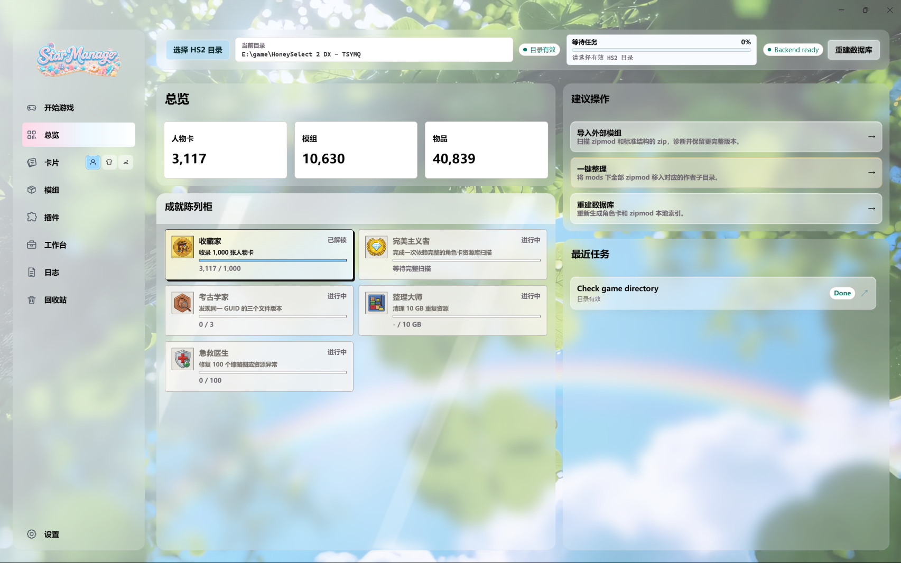
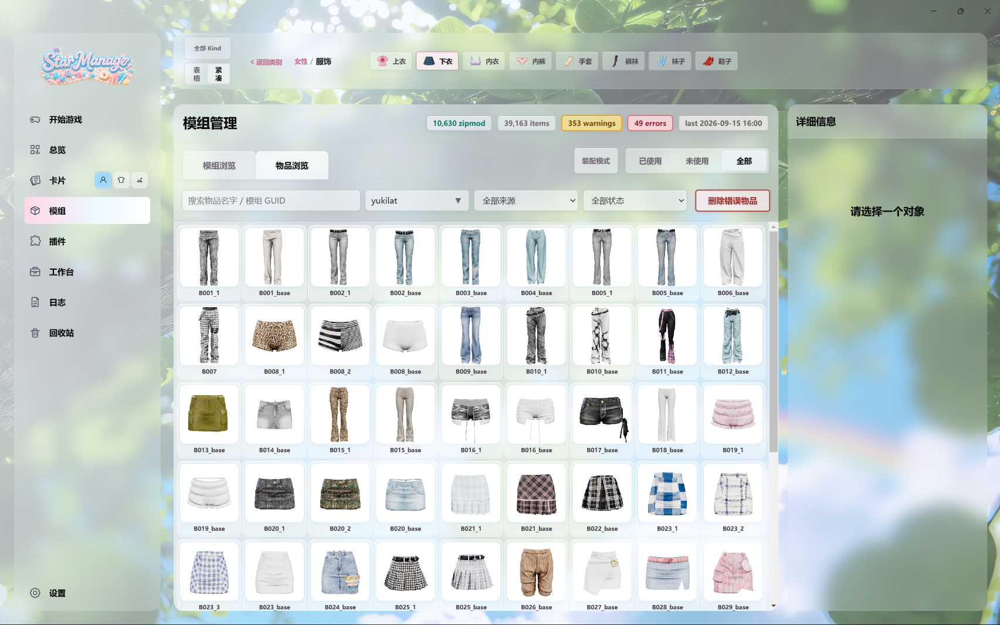
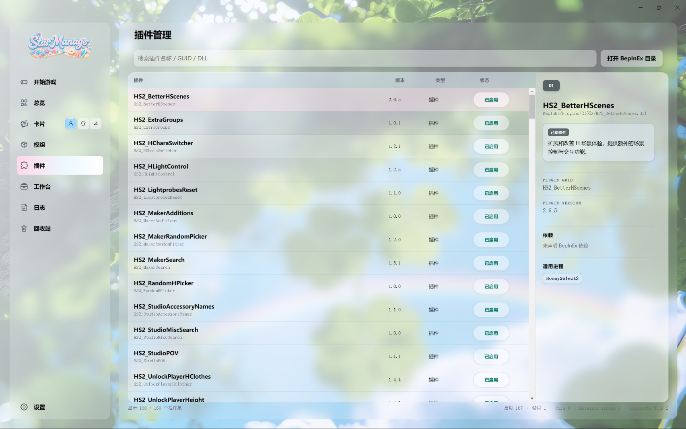
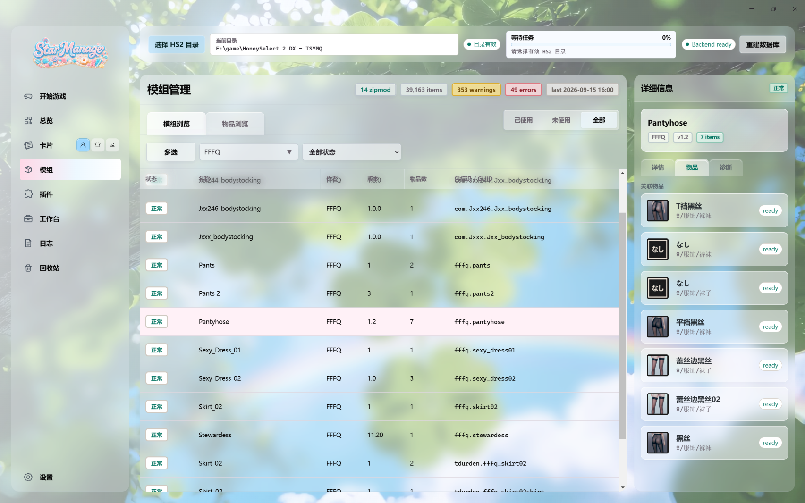
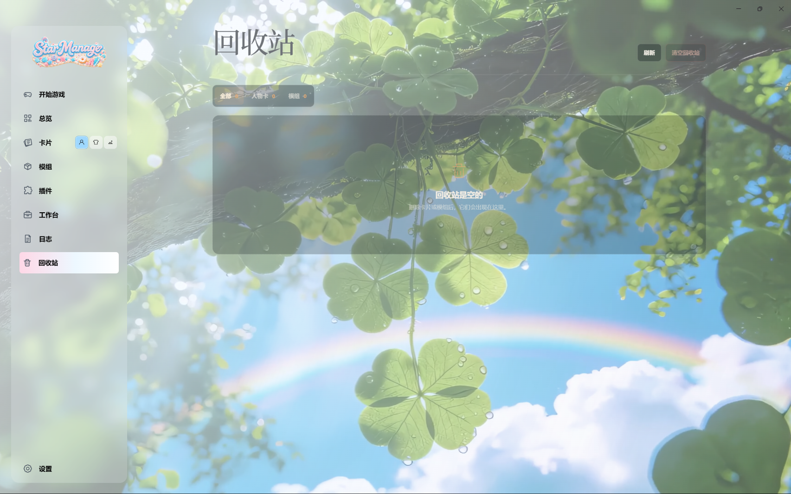
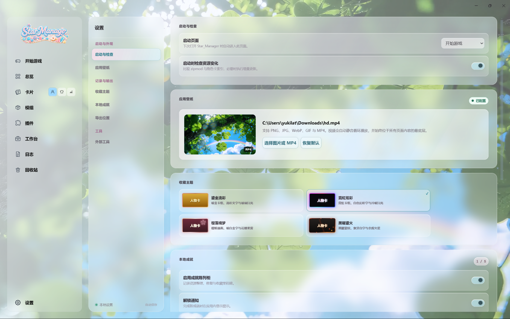
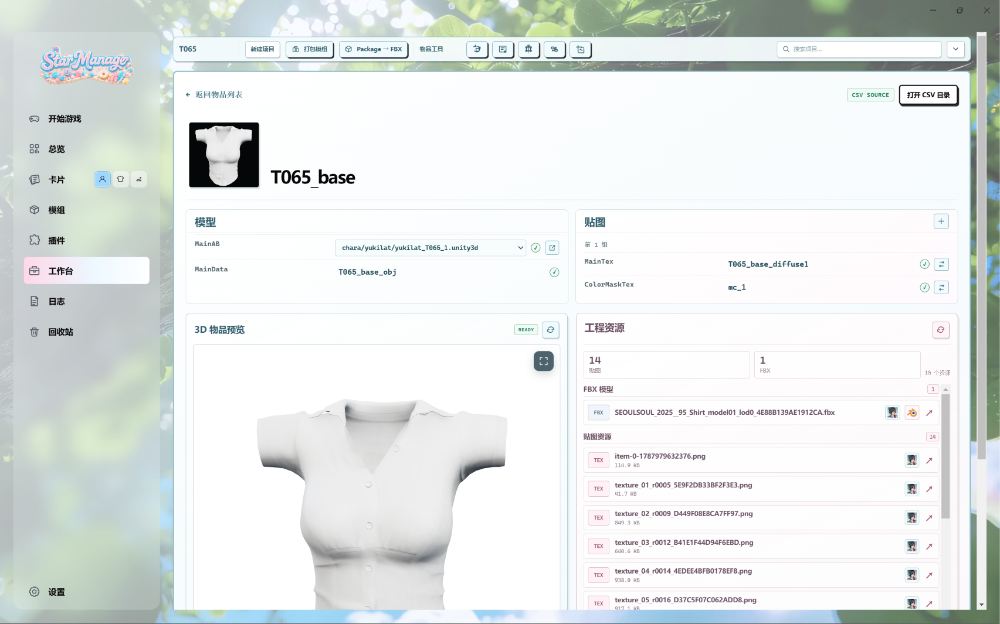

# Star_Manager 概览

## 01. 开始游戏

这是项目的入口页，用于先连接本地 HS2 游戏目录，再进行启动和资源管理。截图中顶部已经选择了游戏目录，界面显示“目录有效”和“Backend ready”，旁边可以观察当前等待任务并触发数据库重建。

页面中部提供“开始游戏”“开始工作室”“开始 VR”等启动入口；左侧“游戏配置”区域可以查看语言、画质、显示器、分辨率和全屏设置；右侧“目录入口”可以快捷打开游戏主目录、`UserData`、工作室场景、截图以及男女角色卡目录。

用户第一次使用时先在这里选择 HS2 目录，确认状态正常，再启动游戏或进入其它资源管理页面。

## 02. 总览

总览页是资源库的仪表盘。顶部三张统计卡概括人物卡、模组和物品数量；截图中的示例数量分别为 3,117、10,630 和 40,839。

下方的“成就陈列柜”展示收藏、扫描、整理和修复等本地进度；右侧“建议操作”提供导入外部模组、一键整理和重建数据库等常用入口；“最近任务”用于确认目录检查和数据库任务是否完成。

这里用于快速判断资源库规模、索引是否健康，以及下一步应该做什么。统计数字来自本地索引，首次扫描或资源发生变化时可能会更新。

## 03. 卡片管理：人物卡浏览器

卡片管理页用于浏览本地人物卡、服装卡和场景卡。截图展示的是人物卡浏览器：左侧导航的卡片入口旁有三种卡片类型切换按钮，中间是当前目录中的卡片网格，顶部提供多选、当前目录/人物卡库切换、标签搜索和卡片范围筛选。

右侧“卡片详情”面板会随选中项变化，截图中能看到人物卡预览、收藏星标、评分、标签和人物参数。用户可以先通过目录和搜索找到卡片，再查看详情、依赖与工具操作。

这是角色资源的视觉浏览器，适合按文件夹、标签、收藏和预览图整理人物卡。人物卡、服装卡和场景卡共用卡片管理入口，但数据目录和详情内容有所区别，详见[角色卡库布局](frontend-ui/character-cards-layout.md)。

## 04. 模组管理：物品浏览

这是模组管理中的“物品浏览”视图。截图顶部显示了女性服饰相关的 Kind 分类；中间区域以网格方式排列大量物品缩略图，并在每个缩略图下显示物品名称或内部标识，例如 `B001_1`、`B002_base` 等。

上方工具栏提供返回分类、Kind 筛选和服饰部位切换；主筛选区支持按物品名称或模组 GUID 搜索，并按作者、来源和状态过滤。右侧是物品详情面板，未选中对象时显示“请选择一个对象”；选中后可继续查看来源、诊断、缩略图和模型相关信息。

物品浏览适合从“具体服装/配饰/身体部件”角度查找资源；它和模组浏览的区别是，前者关注包内单个物品，后者关注整个 zipmod 包。

## 05. 插件管理

插件管理页用于查看游戏目录中的 BepInEx 插件库存。截图左侧列表按行展示插件名称、GUID、版本、类型和启用状态；顶部搜索框支持按插件名称、GUID 或 DLL 文件名查找，右上角可以打开 BepInEx 目录。

选中插件后，右侧详情区会展示插件说明、插件 GUID、版本、依赖和适用进程等信息。截图示例中的插件状态为“已启用”，底部还显示了启用、禁用和元数据错误等汇总信息。

这里是插件清单和诊断入口，用来确认插件是否存在、版本是多少、是否启用以及是否声明了依赖。Star_Manager 读取插件元数据，不执行插件 DLL；单个启用/禁用属于文件名级别的管理操作，通常需要重启游戏才生效。

## 06. 模组管理：模组浏览与详情

这是模组管理中的“模组浏览”视图，与第 04 张图的物品浏览相对应。顶部统计区展示 zipmod 数量、物品数量、警告、错误和最近索引时间；截图示例中选中了 `Pantyhose` 模组。

中间区域是模组表格，每行代表一个 zipmod，列中包含状态、名称、作者、版本、物品数和包标识；上方可以按作者和状态筛选，也可以切换已使用、未使用或全部。右侧详情面板显示模组基本信息，并通过“详情”“物品”“诊断”页签分别查看包信息、包内物品和异常诊断。

模组浏览用于管理“一个完整的 zipmod 包”，适合检查包状态、查看包内内容和定位问题；需要操作单个物品时，再切换到第 04 张图所示的物品浏览。

## 07. 回收站

回收站用于承接人物卡和模组的可恢复删除。截图中回收站为空，因此中央显示空状态提示；上方提供“全部”“人物卡”“模组”分类，并显示各分类数量；右上角有刷新和清空回收站按钮。

当资源被放入回收站后，用户可以在这里按类型查看条目、恢复单项，或执行永久删除/清空操作。回收站页面不负责重新扫描所有资源，模组恢复后的索引修复会遵循现有的回收站和数据库流程。

这里是删除操作的缓冲区。普通删除先进入运行时回收站，只有恢复或永久删除等明确操作才会改变后续结果，详见[回收站说明](trash-recycle-bin.md)。

## 08. 设置

设置页集中管理 Star_Manager 自身的偏好。左侧是设置分类导航，截图当前显示“启动与检查”“应用壁纸”“收藏主题”和“本地成就”等内容，右侧按卡片区块展示具体选项。

截图中可以选择下次启动页面、控制启动时是否检查资源变化；应用壁纸区域支持选择图片或 MP4 并恢复默认；收藏主题区域提供多套人物卡视觉主题；本地成就区域可以启用成就陈列柜和解锁通知。导出位置、工具和 Blender 等设置位于同一页面的其它分类或滚动区域。

设置页调整的是管理器的长期偏好，例如启动行为、壁纸、收藏卡外观、成就和导出目录，不直接替代具体资源页面中的单次操作。

## 09. 工作台：物品工程详情

这是工作台中的单个物品工程页。顶部工具栏显示当前工程 `T065`，并提供新建项目、打包模组、`Package → FBX`、物品工具和工程内搜索等入口。

页面标题为 `T065_base`，上方标记了 CSV 来源并提供打开 CSV 目录的按钮。左侧“模型”区域展示 `MainAB` 和 `MainData` 的关联；右侧“贴图”区域列出 `MainTex`、`ColorMaskTex` 等纹理字段；下方左侧是 3D 物品预览，右侧“工程资源”列出 FBX 和多张贴图资源。

工作台面向模组制作和资源整理，不只是查看数据库。用户可以在工程中维护 CSV 物品字段、选择 Unity3D 模板、预处理 `MainData`，并把模型/贴图等资源写入工程；工作台也保留 Sims 4 Package → FBX 工具入口，详见[工作台文档](frontend-ui/workbench-layout.md)。

## 相关文档

- [项目介绍](project-introduction.md)：产品定位、首次使用流程、完整页面导览和数据边界。
- [项目总览](project-overview.md)：运行架构、目录职责、数据模型和开发边界。
- [前端 UI 文档索引](frontend-ui/README.md)：各页面的详细布局与实现规则。
